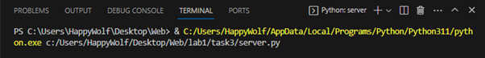
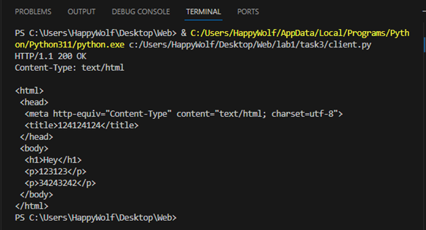

##Задание 3
Реализовать серверную часть приложения. Клиент подключается к серверу. В ответ
клиент получает http-сообщение,содержащее html-страницу, которую сервер
подгружает из файла index.html. 
Обязательно использовать библиотеку socket.

##Сервер
```py
import socket

def sendResponse(connection):
	status = 'HTTP/1.1 200 OK\r\n'
	header = 'Content-Type: text/html\r\n'
	
	ms =  status + header + "\r\n"
	
	htmlFile = open("lab1/task3/index.html", 'r')
	for string in htmlFile:
		ms += string

	connection.send(ms.encode("utf-8"))

PORT = 14900

IP = socket.gethostbyname(socket.gethostname())

listener = socket.socket(socket.AF_INET, socket.SOCK_STREAM)
listener.setsockopt(socket.SOL_SOCKET, socket.SO_REUSEADDR, 1)


listener.bind((IP, PORT))
listener.listen(10)

while True:
	connection, adrress = listener.accept()
	try:
		sendResponse(connection)
		if connection:
			connection.close()

	except Exception as ex:
		print("=== Client connection failed ===\n", ex)

```

##Клиент
```py
import socket

serverIP = "192.168.56.1"
PORT = 14900
buffSize = 16384

connection = socket.socket(socket.AF_INET, socket.SOCK_STREAM)
connection.connect((serverIP, PORT))


try:
    data = connection.recv(buffSize)
    data = data.decode("utf-8")
    print(data)

finally:
    connection.close()
```


##Пример работы

