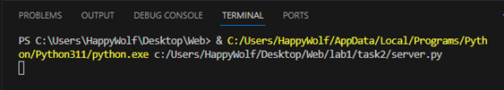
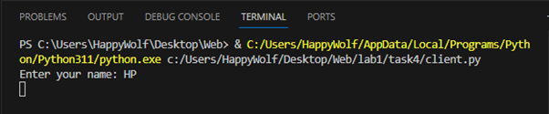
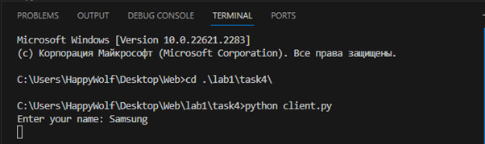
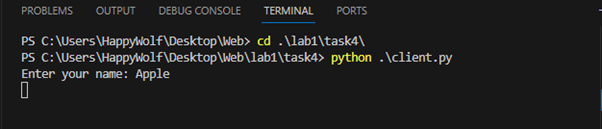
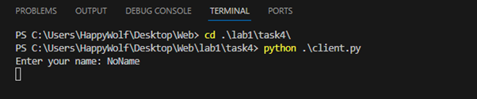
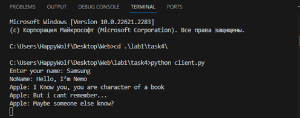
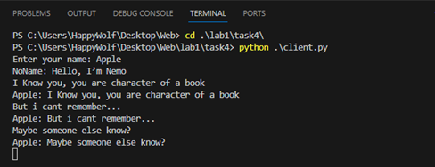
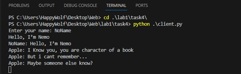

##Задание 4
Реализовать многопользовательский чат. Реализация
многопользовательского часа позволяет получить максимальное количество
баллов.
Обязательно использовать библиотеку socket. Реализовать с помощью протокола TCP – 100% баллов, с помощью UDP – 80%.
Обязательно использовать библиотеку threading.
Для реализации с помощью UDP, thearding использовать для получения
сообщений у клиента.
Для применения с TCP необходимо запускать клиентские подключения И прием
и отправку сообщений всем юзерам на сервере в потоках. Не забудьте сохранять юзеров,
чтобы потом отправлять им сообщения.

##Сервер
```py
import socket
import threading
from time import sleep

IP = "127.0.0.1"

PORT = 14900
buffSize = 16384

session = socket.socket(socket.AF_INET, socket.SOCK_STREAM)
session.setsockopt(socket.SOL_SOCKET, socket.SO_REUSEADDR, 1)

IP = socket.gethostbyname(socket.gethostname())

session.bind((IP, PORT))
session.listen(10)

userList = []

def listener(cSession):
    while True:
        ms = cSession.recv(buffSize).decode('utf-8')
        for i in userList:
            i.send(ms.encode('utf-8'))
        
        if(ms.find("exit_T") != -1):
            #print("EXIT")
            #print(ms, ' ', ms.find("exit_t"), '\n')
            userList.remove(cSession)
            break

while True:
    client_conn, address = session.accept()
    
    userList.append(client_conn)

    clientsServer = threading.Thread(target=listener, args=(client_conn,))
    clientsServer.daemon = True
    clientsServer.start()

```

##Клиент
```py
import socket
import random
import threading
from time import sleep

name = input("Enter your name: ")

serverIP = "192.168.56.1"
PORT = 14900
buffSize = 16384

session = socket.socket(socket.AF_INET, socket.SOCK_STREAM)
session.connect((serverIP, PORT))

def messWait():
    while True:
        data = session.recv(buffSize)
        print(data.decode("utf-8"))

listenerClient = threading.Thread(target=messWait)
listenerClient.daemon = True
listenerClient.start()

while True:
    ms = input()
    ms = name + ': ' + ms
    session.send(ms.encode('utf-8'))
    if(ms == (name + ": " + "exit_T")):
        break

```


##Пример работы








