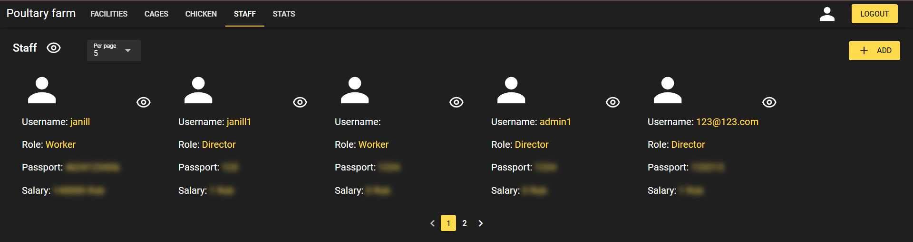
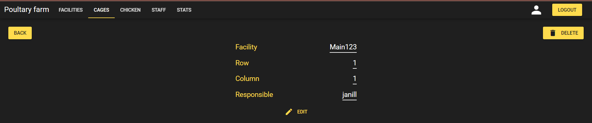

# Реализованные страницы

Для реализации frontend части был выбран Quasar Framework, настроен CORS на Origin `localhost:9000`

Были реализована авторизация, страницы просмотра и изменения сущностей
`Chicken`, `Facility`, `Cage`, `Staff`

Для страницы сущности `Staff` была реализована пагинация, защита конфиденциальной информации. 

Для получения защищенной информации необходимо нажать на соответствующие иконки в виде 

Пример страницы сущности `Cage`. Для остальных сущностей были реализованы аналогичные страницы,
к которым можно получить доступ по адресам:

- `/facilities/{id}`
- `/staff/{username}`
- `/cage/{id}`
- `/chicken/{id}`

