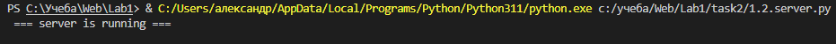
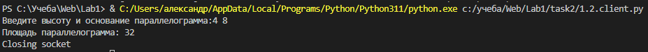
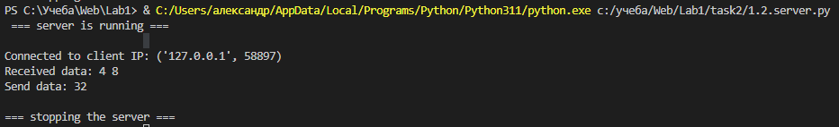

# Задание №2

Реализовать клиентскую и серверную часть приложения. Клиент запрашивает у
сервера выполнение математической операции, параметры, которые вводятся с
клавиатуры. Сервер обрабатывает полученные данные и возвращает результат
клиенту. Вариант: d. Поиск площади параллелограмма. Необходимо исользовать библиотеку socket.

## Выполнение задания
### Серверная часть

```py
import socket

ip     = "127.0.0.1"
port   = 9090
buffer = 1024

# Создание сокета сервера, type=socket.SOCK_STREAM - TCP протокол
TCPSocket = socket.socket(socket.AF_INET, socket.SOCK_STREAM)
TCPSocket.bind((ip, port))
# Ограничиваем количетсво клиентов, которое может подключиться
TCPSocket.listen(1)

print(" === server is running ===\n")

def parallelogramArea(h, a) -> int:
	'''
	Функция для подсчета площади параллелограмма
		Параметры:
				h (int) - высота\n
				a (int) - сторона
	'''
	area = a * h
	return area

while True:
	# Принимаем соединение от клиента: сокет и адресс
	connection, adrress = TCPSocket.accept()

	try:
		print("Connected to client IP: {}".format(adrress))
        
		while True:
			# Получаем данные от клиента
			data = connection.recv(buffer)

			if not data:
				break

			data = data.decode("utf-8")
			print("Received data: {}".format(data))
			
			if data == "stop":
				break
			
			array = list(map(int, data.split()))
			answer = parallelogramArea(array[0], array[1])
			print("Send data: {}".format(answer))
			answer = str.encode(str(answer))
			# Отправляем ответ
			connection.send(answer)

	finally:
		print("\n=== stopping the server ===")
		# Закрываем подключение
		connection.close()
		break
```

### Клиентская часть

```py
import socket

serverAdress    = ("127.0.0.1", 9090)
buffer          = 1024

# Подключаемся к серверу, получаем сокет
TCPSocket = socket.create_connection(serverAdress)
 
try:
    data = input("Введите высоту и основание параллелограмма:")
    data = str.encode(data)
    # Отправляем данные, введенные с клавиатуры
    TCPSocket.sendall(data)
    # Получем ответ от сервера
    data = TCPSocket.recv(buffer)
    data = data.decode("utf-8")
    print("Площадь параллелограмма: {}".format(data))
 
finally:
    print("Closing socket")
    # Закрываем подключение
    TCPSocket.close()
```

## Примеры

Запуск сервера

Запуск клиента, отправка данных серверу, получение ответа

Обработка данных от клиента, отправка ответа
