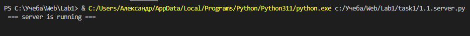
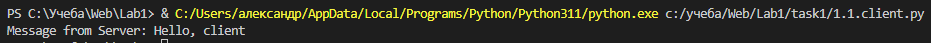
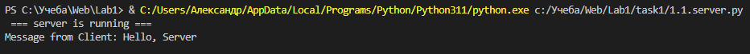

# Задание №1

Реализовать клиентскую и серверную часть приложения. Клиент отсылает серверу
сообщение «Hello, server». Сообщение должно отразиться на стороне сервера.
Сервер в ответ отсылает клиенту сообщение «Hello, client». Сообщение должно
отобразиться у клиента. Необходимо исользовать библиотеку socket. Реализовать необходимо
с помощью протокола UDP.

## Выполнение задания
### Серверная часть

```py
import socket

ip     = "127.0.0.1"
port   = 9090
buffer = 1024

serverMessage  = "Hello, client"
bytesToSend    = str.encode(serverMessage)
UDPSocket = socket.socket(family=socket.AF_INET, type=socket.SOCK_DGRAM)
UDPSocket.bind((ip, port))

print(" === server is running ===")

while True:
    message, address = UDPSocket.recvfrom(buffer)

    if not message:
        break
    
    message = message.decode("utf-8")
    clientMessage = "Message from Client: {}".format(message)
    print(clientMessage)
    UDPSocket.sendto(bytesToSend, address)
```

### Клиентская часть

```py
import socket

clientMessage   = "Hello, Server"
bytesToSend     = str.encode(clientMessage)
serverAdress    = ("127.0.0.1", 9090)
buffer          = 1024

UDPSocket = socket.socket(family=socket.AF_INET, type=socket.SOCK_DGRAM)
UDPSocket.sendto(bytesToSend, serverAdress)
serverMessage = UDPSocket.recvfrom(buffer)

serverMessage = serverMessage[0].decode("utf-8")
serverMessage = "Message from Server: {}".format(serverMessage)
print(serverMessage)
```

## Примеры

Запуск сервера

Запуск клиента, получение сообщения от сервера

Получение сообщения от клиента
