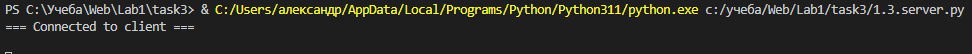
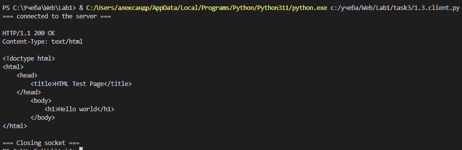

# Задание №3

Реализовать серверную часть приложения. Клиент подключается к серверу. В ответ
клиент получает http-сообщение, содержащее html-страницу, которую сервер
подгружает из файла index.html. Необходимо исользовать библиотеку socket.

## Выполнение задания
### Серверная часть

```py
import socket

class Server:
	def __init__(self, host, port):
		self._host = host
		self._port = port

	def createSocket(self):
		serverSocket = socket.socket(socket.AF_INET, socket.SOCK_STREAM)
		
		try:
			serverSocket.bind((self._host, self._port))
			serverSocket.listen(1)

			while True:
				connection, adrress = serverSocket.accept()
				try:
					print("=== Connected to client ===\n")
					self.sendResponse(connection)
					if connection:
						connection.close()

				except Exception as ex:
					print("=== Client connection failed ===\n", ex)

		finally:
			serverSocket.close()
			print("=== Socket close ===")

	def sendResponse(self, connection):
		file = connection.makefile('wb')
		#Статус
		status = f'HTTP/1.1 200 OK\r\n'
		file.write(status.encode('iso-8859-1'))
		#Заголовки
		header = f'Content-Type: text/html\r\n'
		file.write(header.encode('iso-8859-1'))\
		#Пустая строка
		file.write(b'\r\n')
		#html-код
		htmlFile = open("index.html", 'r')
		for string in htmlFile:
			file.write(string.encode('iso-8859-1'))

		file.flush()
		file.close()

if __name__ == "__main__":
	
	host, port = "127.0.0.1", 9090

	server = Server(host, port)
	try:
		server.createSocket()
	except:
		pass
```

### Клиентская часть

```py
import socket

serverAdress   = ("127.0.0.1", 9090)
buffer         = 8192

TCPSocket = socket.create_connection(serverAdress)
print("=== connected to the server ===\n")
 
try:
    data = TCPSocket.recv(buffer)
    data = data.decode("utf-8")
    print(data)
 
finally:
    print("\n=== Closing socket ===")
    TCPSocket.close()
```

## Примеры

Запуск сервера и обработка запроса клиента

Запуск клиента, получение данных с сервера

