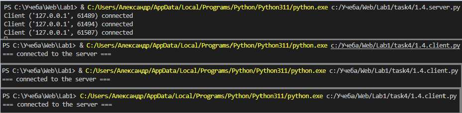
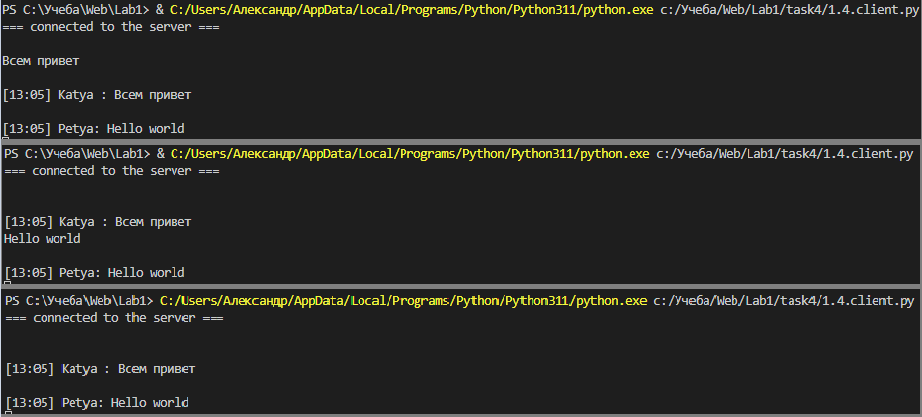

# Задание №4

Реализовать двухпользовательский или многопользовательский чат. Реализация
многопользовательского часа позволяет получить максимальное количество
баллов. Необходимо исользовать библиотеку socket.

## Выполнение задания
### Серверная часть

```py
import socket
from threading import Thread

class Server:
	def __init__(self, host, port, name):
		self._host = host
		self._port = port
		self._name = name
		self.addresses = set()
		self.clients = set()
		self.serverSocket = 0

	def createSocket(self):
		self.serverSocket = socket.socket(socket.AF_INET, socket.SOCK_STREAM)
		try:
			self.serverSocket.bind((self._host, self._port))
			self.serverSocket.listen()

			while True:
				connection, addrress = self.serverSocket.accept()
				self.clients.add(connection)
				self.addresses.add(addrress)
				print(f"Client {addrress} connected")

				thread = Thread(target = self.takeConnections, args = (connection, ))
				thread.daemon = True
				thread.start()

		finally:
			self.serverSocket.close()
			print("=== Socket close ===")

	def takeConnections(self, clientConnection: socket.socket):

		while True:
			try:
				message = clientConnection.recv(1024).decode()

			except Exception as ex:
				print(f"Error when try read message: {ex}")
				self.clients.remove(clientConnection)
			
			for client in self.clients:
				client.send(message.encode())


if __name__ == "__main__":
	
	host, port = "127.0.0.1", 9090
	name = "test.local"

	server = Server(host, port, name)
	try:
		server.createSocket()
	except:
		pass
```

### Клиентская часть

```py
import socket
from threading import Thread
from datetime import datetime
import random

serverAdress    = ("127.0.0.1", 9090)
buffer          = 1024
name = random.choice(('Alex', 'Petya', 'Vasya', 'Timur', 'Ivan', 'Katya '))

TCPSocket = socket.socket()
TCPSocket.connect(serverAdress)
print("=== connected to the server ===\n")

def takeMessages(socket: socket.socket):
    while True:
        message = socket.recv(buffer).decode()
        print(f"\n{message}")

try:
    thread = Thread(target = takeMessages, args = (TCPSocket, ))
    thread.daemon = True
    thread.start()

    while True:
        sendedMessage = input()
        
        if sendedMessage == "quit()":
            break

        timeOfMessage = datetime.now().strftime('%H:%M')
        sendedMessage = f"[{timeOfMessage}] {name}: {sendedMessage}"
        TCPSocket.send(sendedMessage.encode())
 
finally:
    print("\n=== Closing socket ===")
    TCPSocket.close()


```

## Примеры

Запуск сервера, подлкючение 3-х пользователей

Отправка/получение сообщений от пользователей

