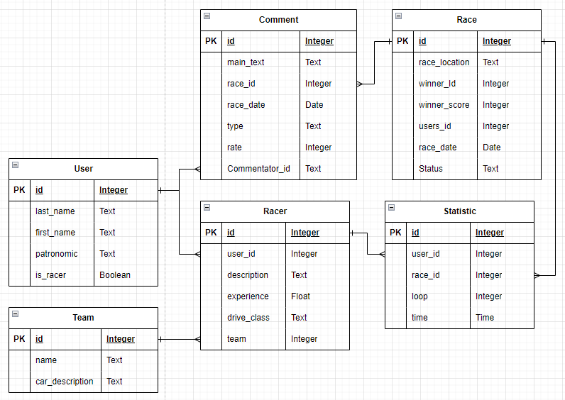

## Постановка задачи

### **№6 - Табло победителей автогонок**  

Необходимо реализовать следующий функционал

+ Регистрация новых пользователей

+ Просмотр автогонок и регистрацию гонщиков. Пользователь должен иметь возможность редактирования
  и удаления своих регистраций.

+ Написание отзывов и комментариев к автогонкам. Предварительно
  комментатор должен зарегистрироваться. При добавлении комментариев
  должны сохраняться даты заезда, текст комментария, тип комментария
  (вопрос о сотрудничестве, вопрос о гонках, иное), рейтинг (1-10),
  информация о комментаторе.

+ Администратор должен иметь возможность указания времени заезда и
  результата средствами Django-admin.

+ В клиентской части должна формироваться таблица всех заездов и
  результатов конкретной гонки.

## Описание созданной модели данных
#### **User** - пользователь
+ username - логин пользователя
+ password - пароль пользователя  

+ last_name - фамилия пользователя
+ first_name - имя пользователя
+ patronymic - отчество пользователя
+ is_racer - отметка, является ли пользователь участником гонок

#### **Racer** - участник гонки / гонщик
+ user_id - пользователь
+ description - описание гонщика
+ experience - опыт гонщика в годах
+ drive_class - класс гонщика
+ team - команда гонщика

#### **Team** - команда
+ name - название команды
+ car_description - описание машины, на который команда учавствует в гонках

#### **Race** - гонка
+ race_location - описание локации гонки
+ winner_id - победитель гонки
+ winner_score - очки победителя
+ users_id - список участников
+ race_date - дата гонки
+ status - статус гонки (не началась; началась; закончилась; приостановлена)

#### **Statistic** - статистика гонок
+ user_id - гонщик
+ race_id - гонка
+ loop - количество кругов, в которых участвовал гонщик
+ time - время затраченное на гонку

#### **Comment** - статистика гонок
+ main_text - текст комментария
+ race_id - гонка
+ race_date - дата гонки
+ type - тип комментария
+ rate - рейтинг комментария
+ commentator_id - пользователь

#### Схема базы данных

