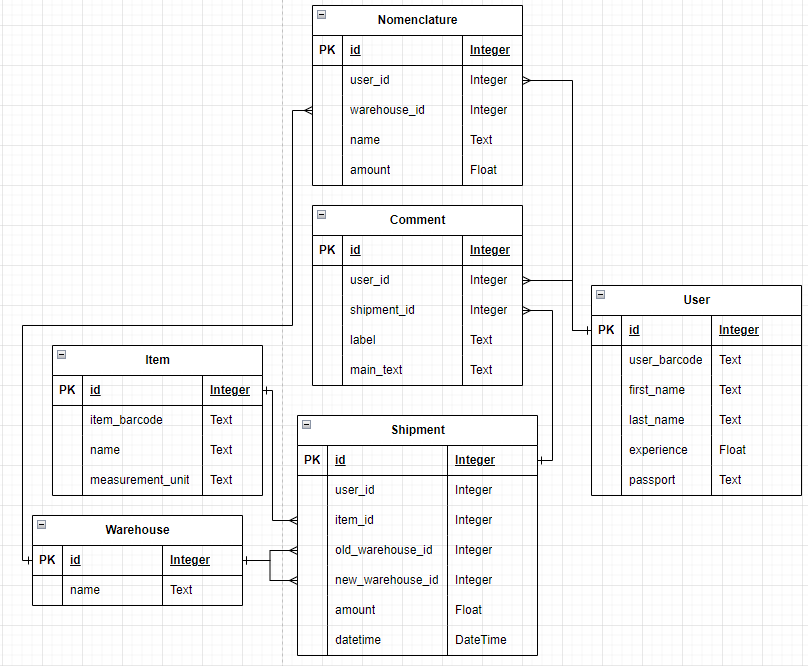

## оздание базы данных

### **Выбран свой вариант: база данных склада для хранения предметов**  

Был реализован следующий функционал:

+ Просмотр всех предметов

+ Просмотр данных о конкретном предмете и местах его хранения

+ Добавление новых прдеметов.

+ Получение списка хранящихся на складе прдеметов.

+ Получения списка инвентаризаций, а так же получение данных о конкретной инвентаризации
и комментариев об этой инветаризации.

+ Возможность отгрузки предметов с одного склада на другой.

## Описание созданной модели данных
#### **User** - пользователь
+ username - логин пользователя
+ password - пароль пользователя  

+ user_barcode - личный штрихкод пользователя
+ last_name - фамилия пользователя
+ first_name - имя пользователя
+ experience - опыт пользователя
+ passport - паспорт пользователя

#### **Item** - предметы (товар)
+ item_barcode - штрихкод товара
+ name - описание товара
+ measurement_unit - единицы измерения товара (кг; шт; мл)

#### **Warehouse** - склад
+ name - название склада

#### **Shipment** - отгрузка товара
+ user_id - сотрудник, отвечающий за отгрузку
+ item_id - товар, который был отгружен
+ old_warehouse_id - изначальный склад
+ new_warehouse_id - склад / пункт назначения
+ amount - количество для отгрузки
+ datetime - время и дата

#### **Nomenclature** - номенклатура товара
+ item_id - товар
+ warehouse_id - склад
+ name - доп. описание
+ amount - количество на складе

#### **Comment** - статистика гонок
+ user_id - пользователь
+ shipment_id - отгрузка
+ label - заголовок
+ main_text - содержание

#### Схема базы данных

