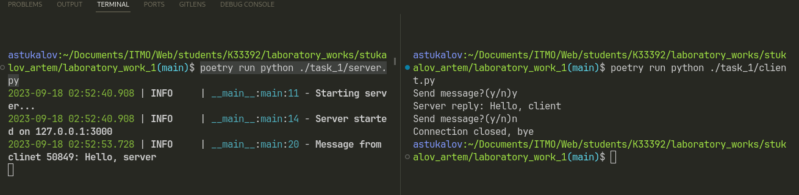

# Задание 1

Реализовать клиентскую и серверную часть приложения. Клиент
отсылает серверу сообщение «Hello, server». Сообщение должно
отразиться на стороне сервера. Сервер в ответ отсылает клиенту
сообщение «Hello, client». Сообщение должно отобразиться у клиента.
Обязательно использовать библиотеку socket. Реализовать с помощью
протокола UDP.

## Выполнение

### Реализация сервера

::: task_1.server.main

### Реализация клиента

::: task_1.client.main

## Пример работы

