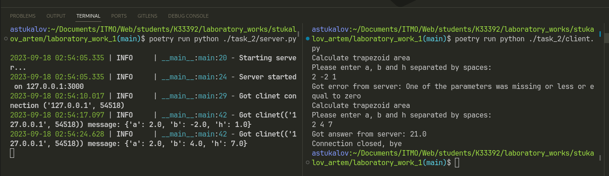

# Задание 2

Реализовать клиентскую и серверную часть приложения. Клиент
запрашивает у сервера выполнение математической операции, параметры,
которые вводятся с клавиатуры. Сервер обрабатывает полученные данные
и возвращает результат клиенту. Вариант “поиск площади трапеции”.

## Выполнение

### Реализация сервера

::: task_2.server.main

### Реализация клиента

::: task_2.client.main

## Пример работы

