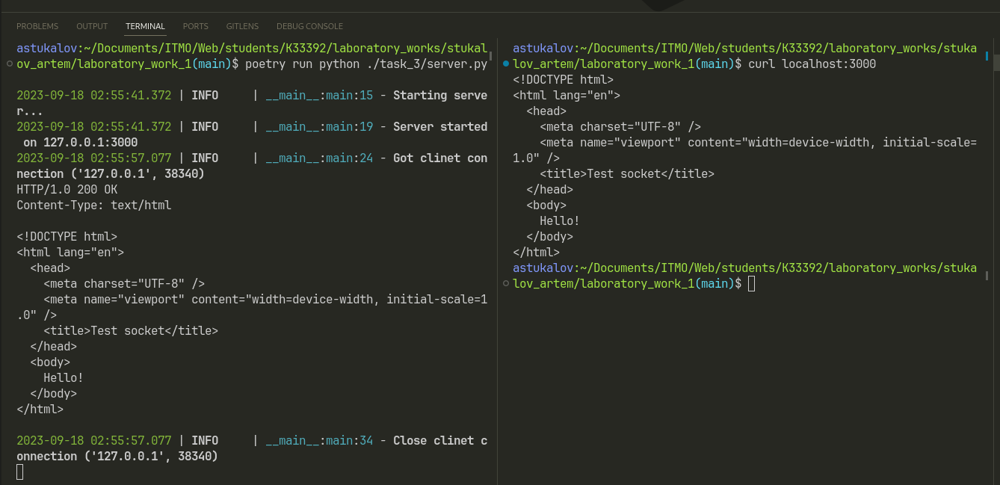

# Задание 3

Реализовать серверную часть приложения. Клиент подключается к
серверу. В ответ клиент получает http-сообщение, содержащее
html-страницу, которую сервер подгружает из файла index.html.

## Выполнение

### Реализация сервера

::: task_3.server.main

## Пример работы

