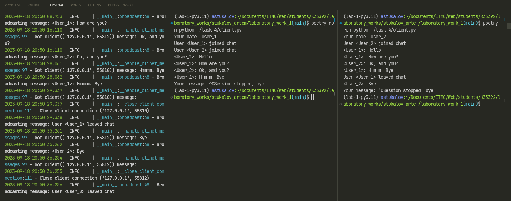

# Задание 4

Реализовать многопользовательский чат. Для применения с TCP
необходимо запускать клиентские подключения И прием и отправку
сообщений всем юзерам на сервере в потоках. Не забудьте сохранять
юзеров, чтобы потом отправлять им сообщения.

## Выполнение

### Реализация сервера

::: task_4.server.Client
::: task_4.server.SocketChatServer

### Реализация клиента

::: task_4.client.Client

## Пример работы

