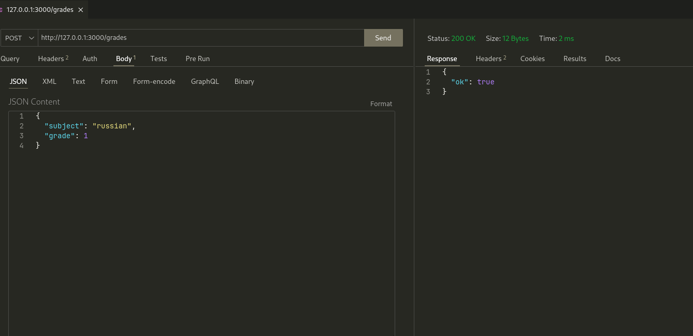
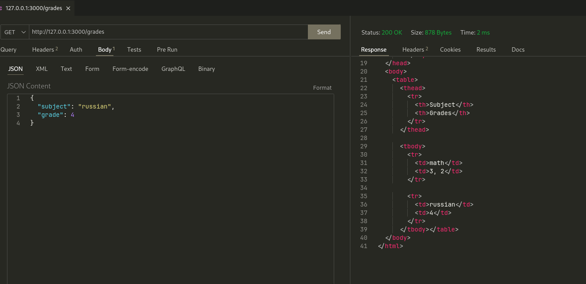

# Задание 5

Необходимо написать простой web-сервер для обработки GET и
POST http запросов средствами Python и библиотеки socket. Сделать
сервер, который может:

- Принять и записать информацию о дисциплине и оценке по
  дисциплине.
- Выдать информацию обо всех оценках по дисциплине в виде
  html-страницы.

## Выполнение

### Реализация сервера

::: task_5.server.Request
::: task_5.server.Response
::: task_5.server.HTTPError
::: task_5.server.MyHTTPServer
::: task_5.server.get_html_base
::: task_5.server.grades_to_html_table
::: task_5.server.handle_get_grades
::: task_5.server.handle_add_grade

## Пример работы

