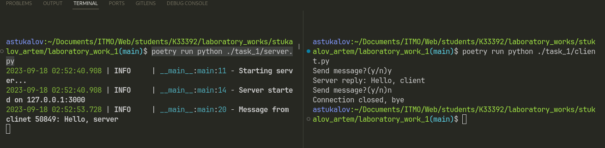

# Задание 1

???+ question "Задание"

    Реализовать клиентскую и серверную часть приложения. Клиент
    отсылает серверу сообщение «Hello, server». Сообщение должно
    отразиться на стороне сервера. Сервер в ответ отсылает клиенту
    сообщение «Hello, client». Сообщение должно отобразиться у клиента.
    Обязательно использовать библиотеку socket. Реализовать с помощью
    протокола UDP.

## Выполнение

=== "Сервер"

    ```Python title="server.py"
    --8<-- "laboratory_work_1/task_1/server.py"
    ```

=== "Клиент"

    ```Python title="client.py"
    --8<-- "laboratory_work_1/task_1/client.py"
    ```

## Пример работы


