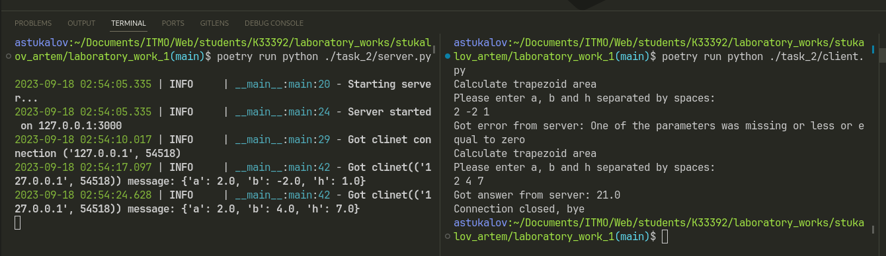

# Задание 2

???+ question "Задание"

    Реализовать клиентскую и серверную часть приложения. Клиент
    запрашивает у сервера выполнение математической операции, параметры,
    которые вводятся с клавиатуры. Сервер обрабатывает полученные данные
    и возвращает результат клиенту. Вариант “поиск площади трапеции”.

## Выполнение

=== "Сервер"

    ```Python title="server.py"
    --8<-- "laboratory_work_1/task_2/server.py"
    ```

=== "Клиент"

    ```Python title="client.py"
    --8<-- "laboratory_work_1/task_2/client.py"
    ```

## Пример работы


