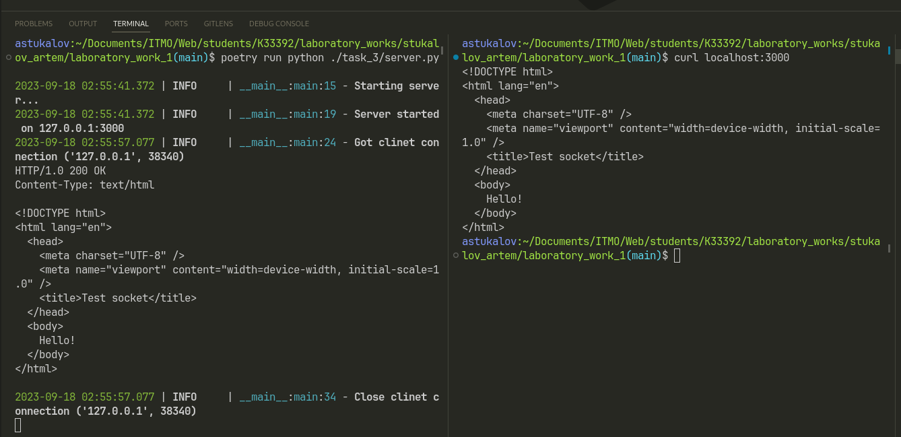

# Задание 3

???+ question "Задание"

    Реализовать серверную часть приложения. Клиент подключается к
    серверу. В ответ клиент получает http-сообщение, содержащее
    html-страницу, которую сервер подгружает из файла index.html.

## Выполнение

=== "Сервер"

    ```Python title="server.py"
    --8<-- "laboratory_work_1/task_3/server.py"
    ```

## Пример работы


