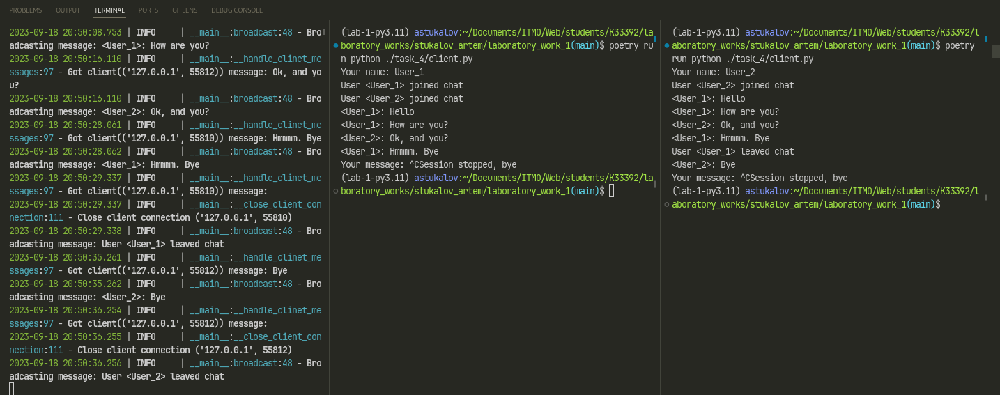

# Задание 4

???+ question "Задание"

    Реализовать многопользовательский чат. Для применения с TCP
    необходимо запускать клиентские подключения И прием и отправку
    сообщений всем юзерам на сервере в потоках. Не забудьте сохранять
    юзеров, чтобы потом отправлять им сообщения.

## Выполнение

=== "Сервер"

    ```Python title="server.py"
    --8<-- "laboratory_work_1/task_4/server.py"
    ```

=== "Клиент"

    ```Python title="client.py"
    --8<-- "laboratory_work_1/task_4/client.py"
    ```

## Пример работы


