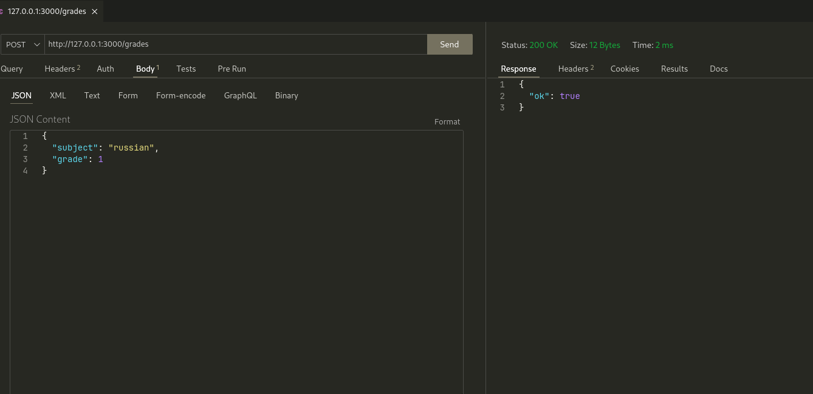
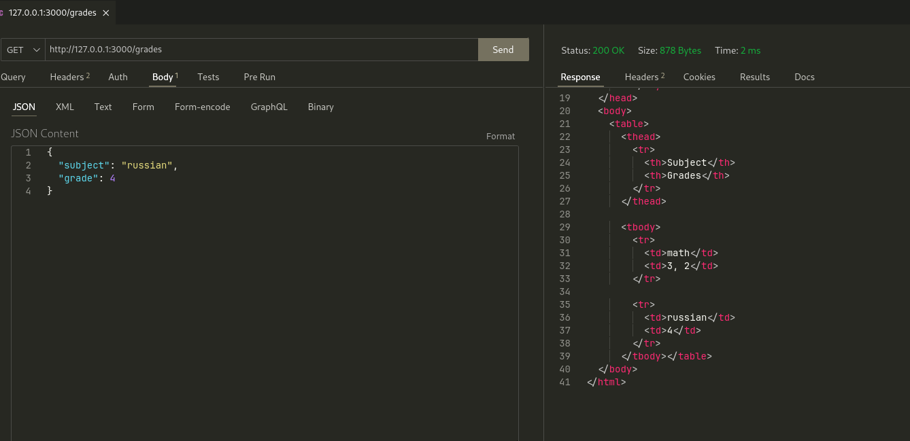

# Задание 5

???+ question "Задание"

    Необходимо написать простой web-сервер для обработки GET и
    POST http запросов средствами Python и библиотеки socket. Сделать
    сервер, который может:

    - Принять и записать информацию о дисциплине и оценке по
      дисциплине.
    - Выдать информацию обо всех оценках по дисциплине в виде
      html-страницы.

## Выполнение

=== "Сервер"

    ```Python title="server.py"
    --8<-- "laboratory_work_1/task_5/server.py"
    ```

## Пример работы



