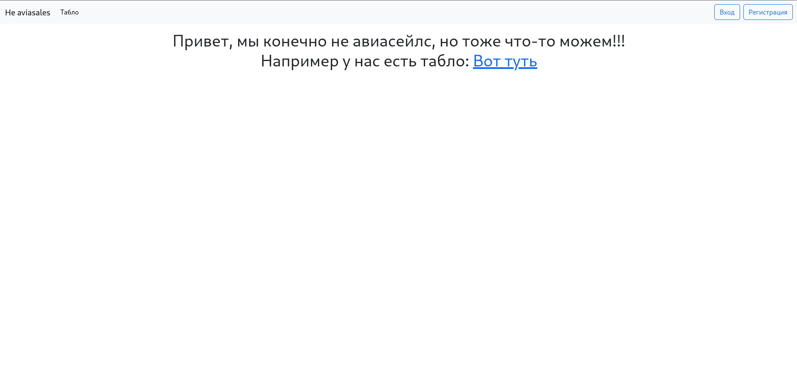
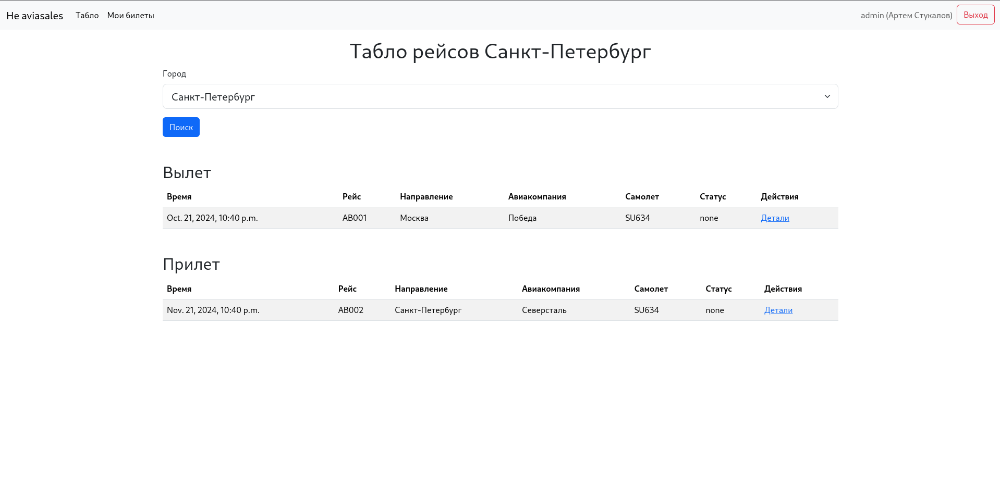
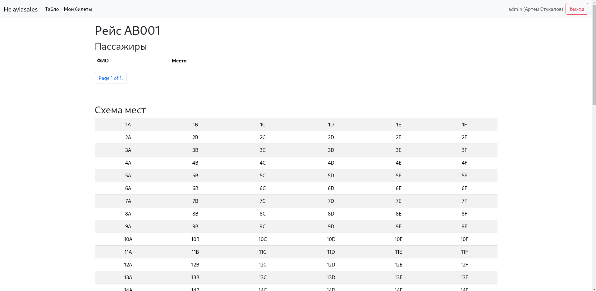
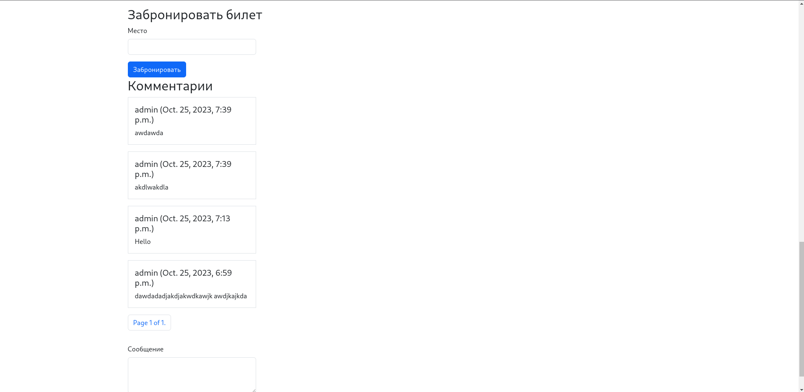
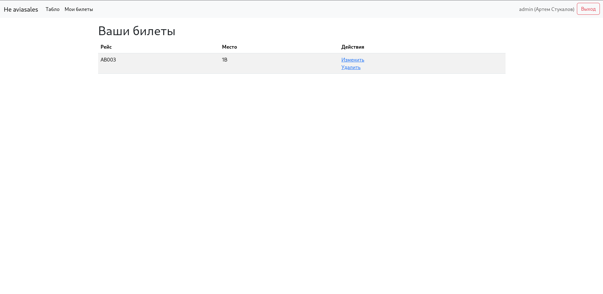

# Темплейты/Стилизация

Для добавления css стилей использовался bootstrap 5.  
В рамках проекта выделим основные страницы:

## Главная

Тут просто немного информации о сайте

## Табло рейсов

Пользователь может выбрать аэропорт(город), табло которого хочет посмотреть. После выбора пользователь увидит 2 таблицы: рейсы вылета и рейсы прилета

## Страница рейса

На данной странице представлена подробная информация о рейсе, пассажирах рейса. Также есть схема мест в самолете.
Если пользователь вошел в свой аккаунт, то у него есть возможость выбрать место и купить билет. Также посльзователь может оставить комментарий к рейсу

## Страница купленных билетов

Страница доступна пользователю, который вошел в аккаунт. Отображает в виде таблицы все купленные пользователем билеты. Есть возможность как сдать билет, так и изменить забронированное место.

