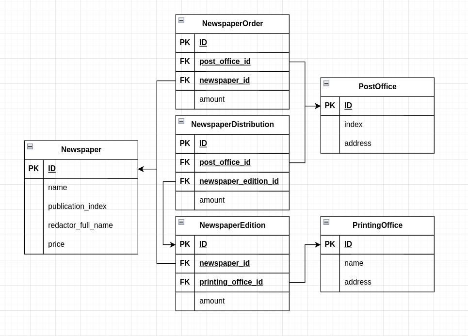

# Модели

Опираясть на условия лабораторной работы, составим схему БД



=== "Newspaper"

    ```Python title="Newspaper"
    --8<-- "laboratory_work_3/newspapers/models.py:4:11"
    ```

=== "PrintingOffice"

    ```Python title="PrintingOffice"
    --8<-- "laboratory_work_3/newspapers/models.py:14:19"
    ```

=== "PostOffice"

    ```Python title="PostOffice"
    --8<-- "laboratory_work_3/newspapers/models.py:22:27"
    ```

=== "NewspaperEdition"

    ```Python title="NewspaperEdition"
    --8<-- "laboratory_work_3/newspapers/models.py:30:37"
    ```

=== "NewspaperOrder"

    ```Python title="NewspaperOrder"
    --8<-- "laboratory_work_3/newspapers/models.py:40:47"
    ```

=== "NewspaperDistribution"

    ```Python title="NewspaperDistribution"
    --8<-- "laboratory_work_3/newspapers/models.py:50:57"
    ```
