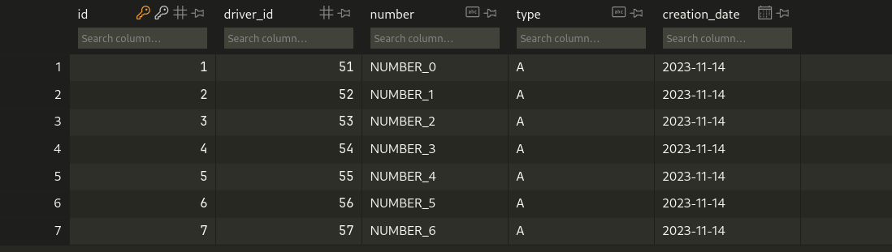
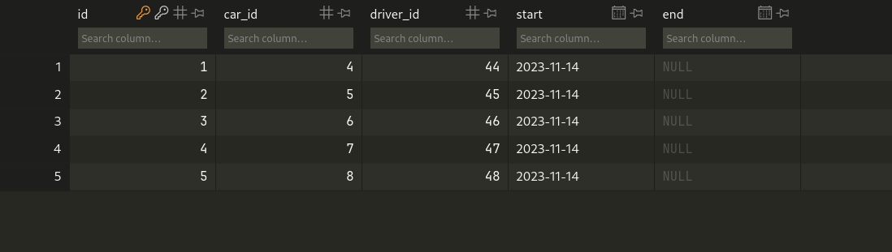
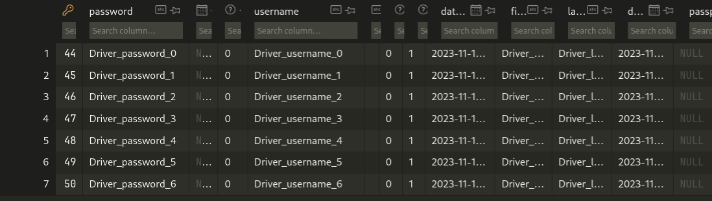

# Задание 1

???+ question "Задание"
    Напишите запрос на создание 6-7 новых автовладельцев и 5-6 автомобилей, каждому автовладельцу назначьте удостоверение и от 1 до 3 автомобилей. Задание можете выполнить либо в интерактивном режиме интерпретатора, либо в отдельном python-файле. Результатом должны стать запросы и отображение созданных объектов.

## Выполнение

Запишем весь скрипт в файл `temp/task_1.py`. Используя методы `objects.create()` создадим необходимые инстансы моделей.

```python
from project_first_app.models import Driver, Car, Ownership, DriverLicense
from django.utils import timezone

drivers = []
for i in range(0, 7):
    driver = Driver.objects.create(
        username=f"Driver_username_{i}",
        password=f"Driver_password_{i}",
        last_name=f"Driver_last_name_{i}",
        first_name=f"Driver_first_name_{i}",
        date_of_birth=timezone.now(),
    )
    drivers.append(driver)

cars = []
for i in range(0, 5):
    car = Car.objects.create(
        number=f"Number_{i}",
        brand=f"Brand_{i}",
        model=f"Model_{i}",
        color="White",
    )
    cars.append(car)

for i in range(0, 5):
    Ownership.objects.create(driver=drivers[i], car=cars[i], start=timezone.now())

for i in range(0, 7):
    DriverLicense.objects.create(
        driver=drivers[i], number=f"NUMBER_{i}", type="A", creation_date=timezone.now()
    )

```




