# Реализация веб-сервиса зоопарка Django + React

## 1. Задача

Целью было создать клиентскую часть средствами Vue.js - в моем случае это было реализовано с помощью React.

## 2. Как выполнялась работа

Были добавлены новые эндпоинты, отвечающие за работу с аккаунтом юзера - Для этого сперва пришлось сделать кастомную модель юзера - была произведена нехитрая настройка корсов и с помощью vite был создан темплейта для клиенской части. На фронт-энде я реализовал обращения к моему django серверу и добавил немного ui библиотек для лучшей отзывчивости и приятной работы с сайтом - например был использован react-toastify для уведомлений пользователя об усмешности его дейстий. Также были использованы такие бибиотеки как react-router-dom и redux - первая для навигации по страницам, а вторая для хранения глобального стейта приложения, в моем случае это данные залогиненного юзера.

## 3. Фрагменты кода

### Фрагмент раутинга:

```
<>
      <Router>
        <Nav />
        <Routes>
          <Route path='/' element={<HomePage />} />
          <Route path='/login' element={<LoginPage />} />
          <Route path='/register' element={<RegisterPage />} />
          <Route path='/reset-password' element={<ResetPasswordPage />} />
          <Route path='/activate/:uid/:token' element={<ActivatePage />} />
          <Route
            path='/password/reset/confirm/:uid/:token'
            element={<ResetPasswordPageConfirm />}
          />
          <Route path='/dashboard' element={<Dashboard />} />
          <Route path='*' element={<NotFoundPage />} />
        </Routes>
      </Router>
      <ToastContainer />
    </>
```

### Фрагменты регистрации:

```
const register = async (userData) => {
  const config = {
    headers: {
      'Content-type': 'application/json',
    },
  }

  const response = await axios.post(REGISTER_URL, userData, config)

  return response.data
}


export const register = createAsyncThunk(
  'auth/register',
  async (userData, thunkAPI) => {
    try {
      return await authService.register(userData)
    } catch (error) {
      const message =
        (error.response &&
          error.response.data &&
          error.response.data.message) ||
        error.message ||
        error.toString()

      return thunkAPI.rejectWithValue(message)
    }
  }
)
```

### Фрагменты авторизации:

```
const login = async (userData) => {
  const config = {
    headers: {
      'Content-type': 'application/json',
    },
  }

  const response = await axios.post(LOGIN_URL, userData, config)

  if (response.data) {
    localStorage.setItem('user', JSON.stringify(response.data))
  }

  return response.data
}

export const login = createAsyncThunk(
  'auth/login',
  async (userData, thunkAPI) => {
    try {
      return await authService.login(userData)
    } catch (error) {
      const message =
        (error.response &&
          error.response.data &&
          error.response.data.message) ||
        error.message ||
        error.toString()

      return thunkAPI.rejectWithValue(message)
    }
  }
)
```

### Фрагмент отправки запроса на создание нового пользователя:

```
const handleSubmit = (e) => {
    e.preventDefault()

    if (password !== re_password) {
      toast.error('Passwords do not match')
    } else {
      const userData = {
        first_name,
        last_name,
        email,
        password,
        re_password,
      }
      dispatch(register(userData))
    }
  }
```

## 4. Скриншоты работы

### Регистрация + авторизация

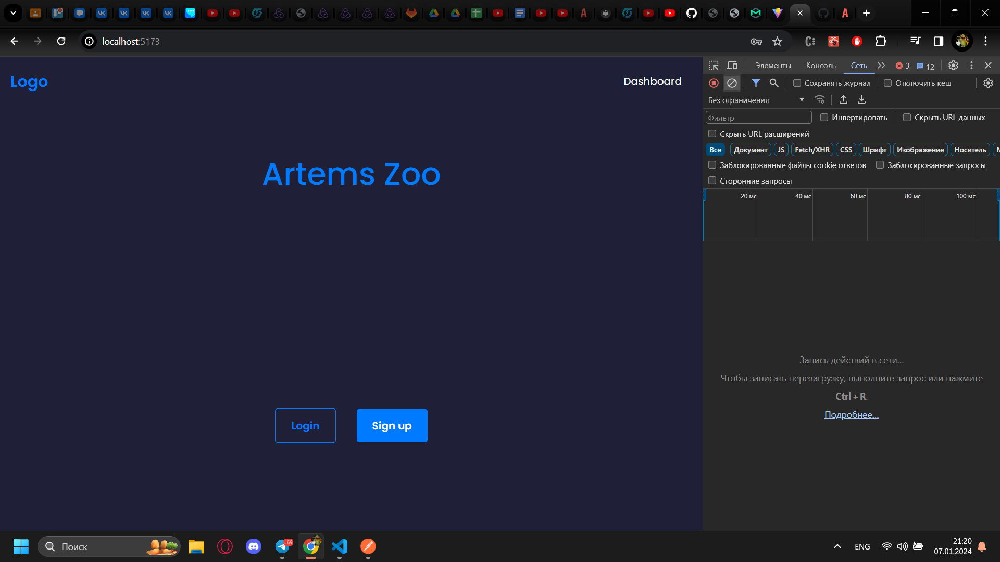

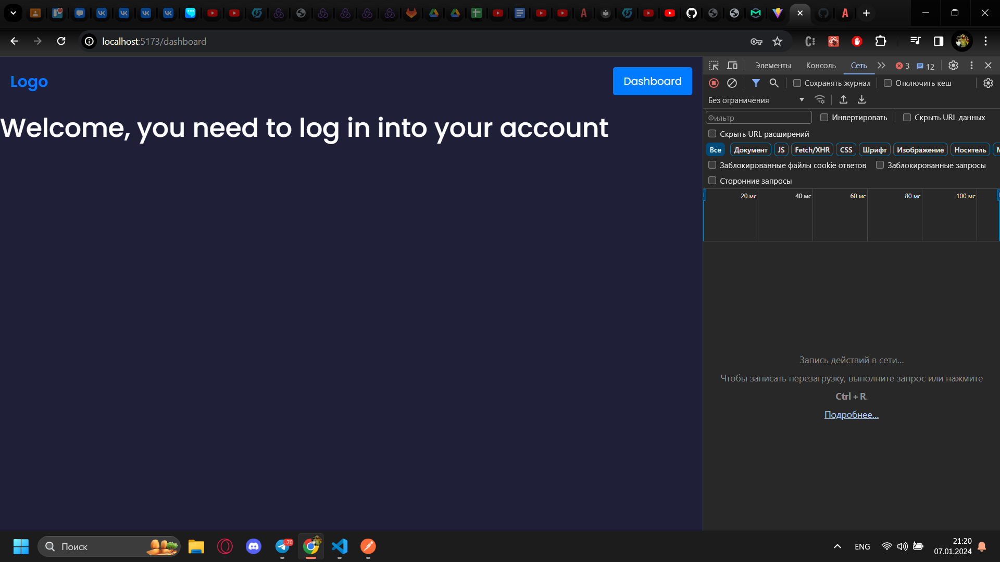

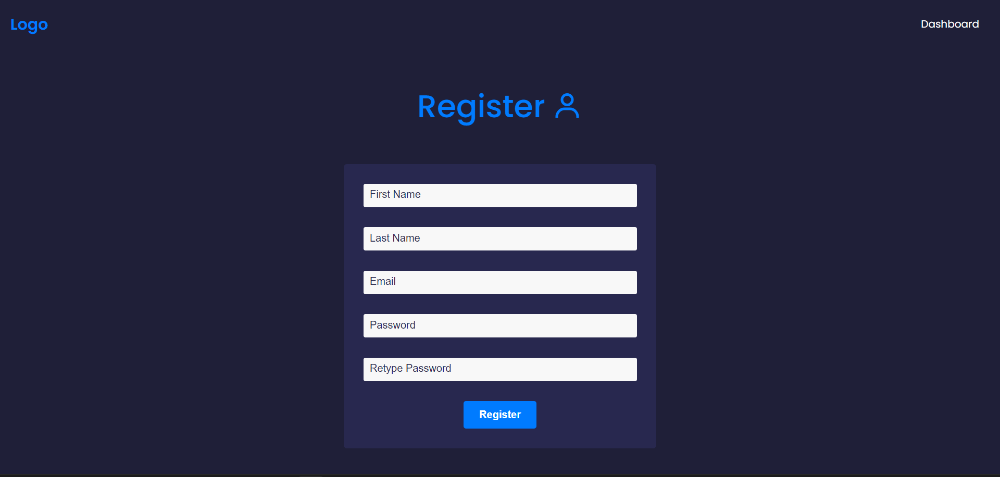

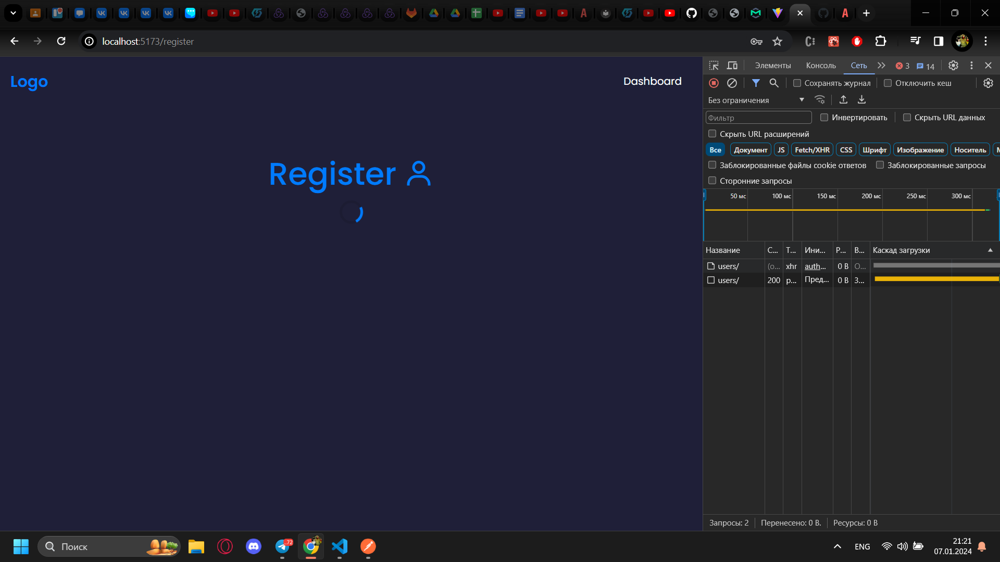

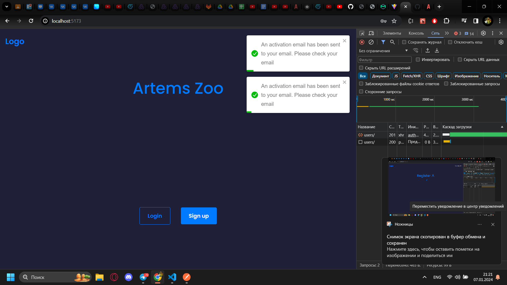

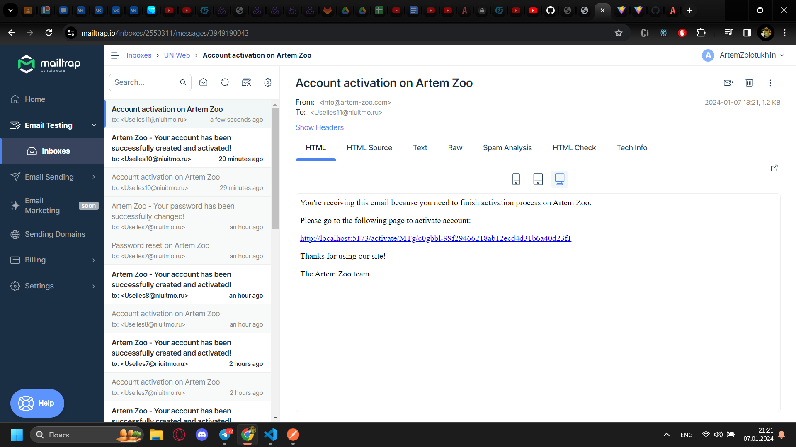

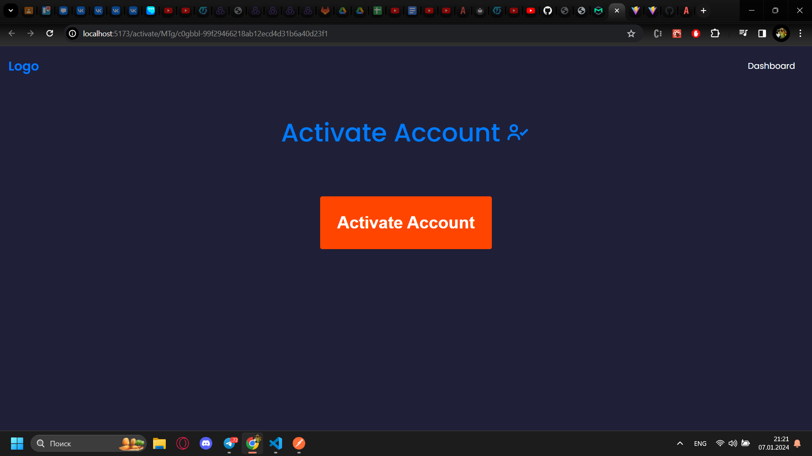

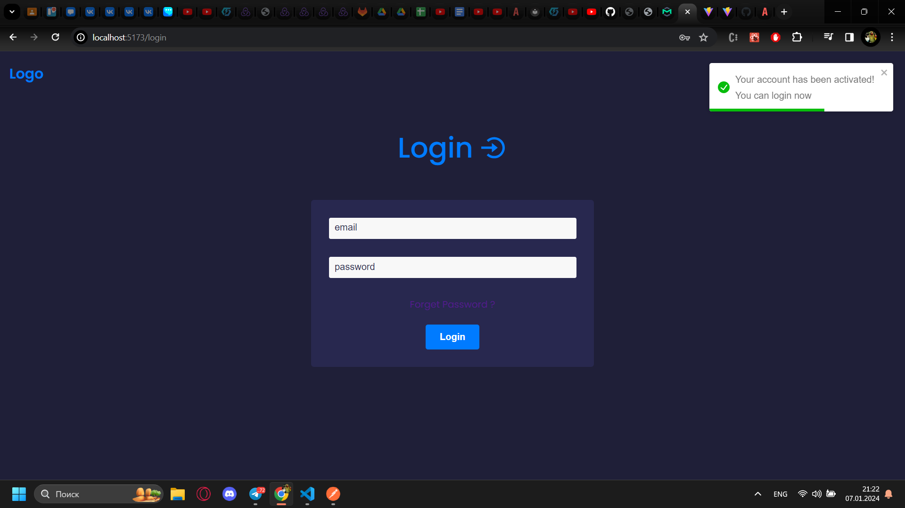

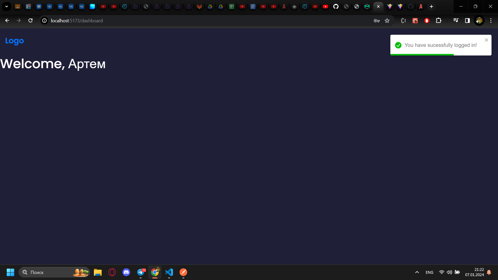

### Смена пароля

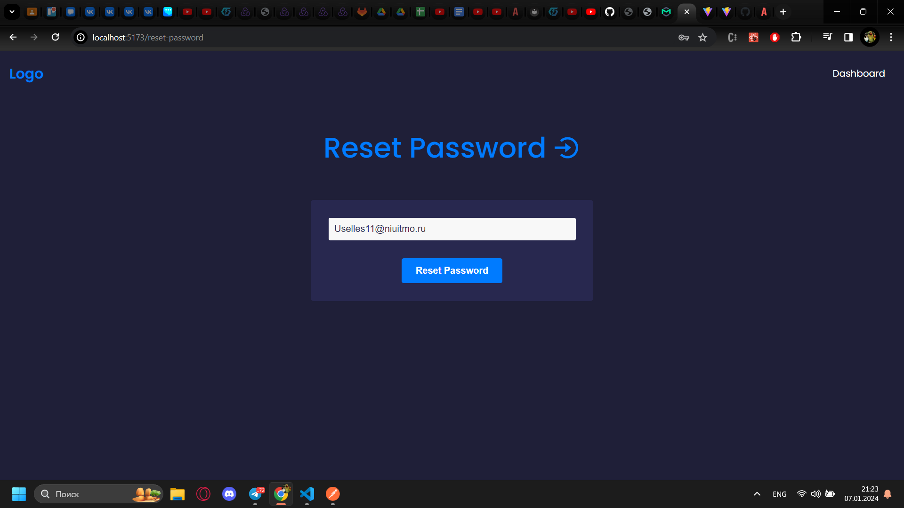

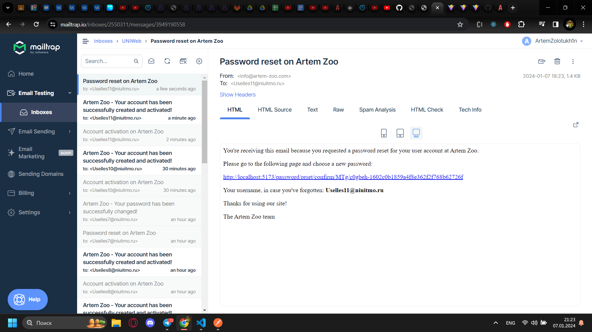

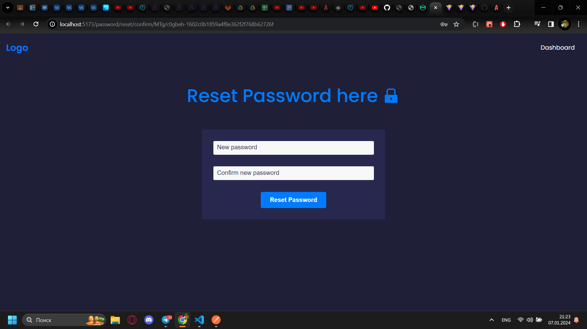

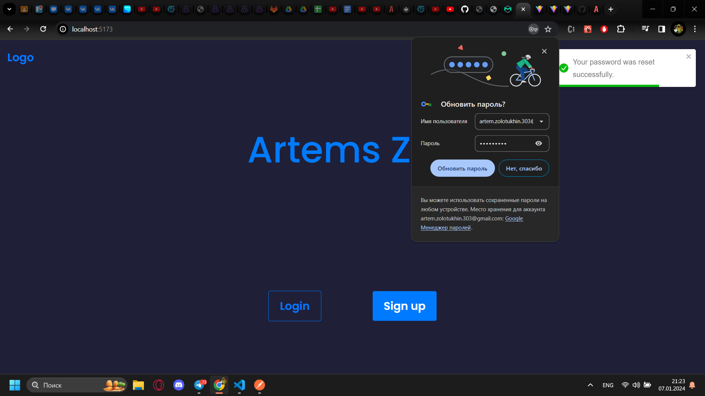
