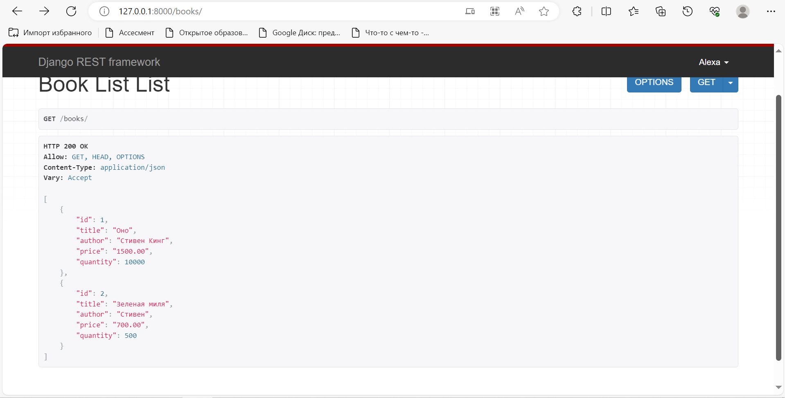
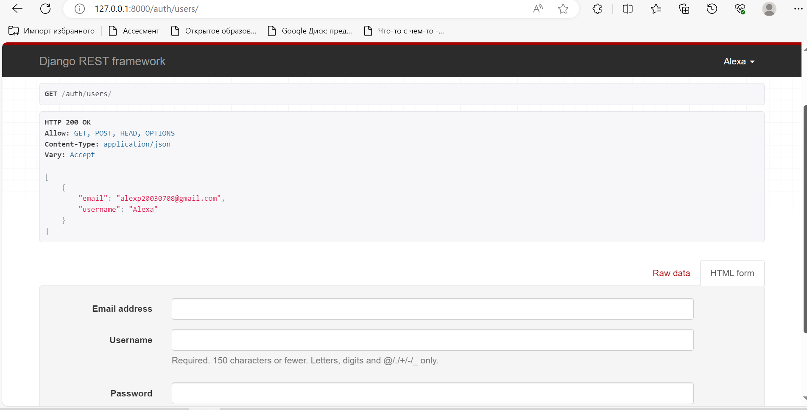
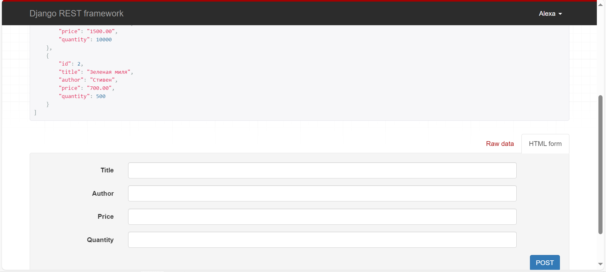

Цель: создать бэкэнд часть книжного интернет-магазина.

Модель(models.py):

    from django.db import models #Импорт модуля models из Django, который используется для создания моделей базы данных.
    from django.contrib.auth.models import AbstractUser, Group, Permission
    
    class User(AbstractUser):
        name = models.CharField(max_length=100)
        email = models.EmailField(unique=True)
        password = models.CharField(max_length=100)
    
        # Переопределение поля groups
        groups = models.ManyToManyField(
            Group,
            verbose_name='groups',
            blank=True,
            help_text='The groups this user belongs to. A user will get all permissions granted to each of their groups.',
            related_name="custom_user_groups", # Измененный related_name
            related_query_name="user",
        )
    
        # Переопределение поля user_permissions
        user_permissions = models.ManyToManyField(
            Permission,
            verbose_name='user permissions',
            blank=True,
            help_text='Specific permissions for this user.',
            related_name="custom_user_permissions", # Измененный related_name
            related_query_name="user",
        )
    
        class Meta:
            app_label = 'book'
    
    class Book(models.Model):
        title = models.CharField(max_length=255)
        author = models.CharField(max_length=255)
        price = models.DecimalField(max_digits=8, decimal_places=2)
        quantity = models.IntegerField()
    
    class Order(models.Model):
        user = models.ForeignKey(User, on_delete=models.CASCADE)
        book = models.ForeignKey(Book, on_delete=models.CASCADE)
        quantity = models.PositiveIntegerField(default=1)
        total_price = models.DecimalField(max_digits=10, decimal_places=2)
    
    class Review(models.Model):
        user = models.ForeignKey(User, on_delete=models.CASCADE)
        book = models.ForeignKey(Book, on_delete=models.CASCADE)
        rating = models.PositiveIntegerField(default=0)
        comment = models.TextField()

Serializers.py:

    from rest_framework import serializers
    from .models import User, Book, Order, Review
    
    
    class UserSerializer(serializers.ModelSerializer):
        class Meta:
            model = User
            fields = ['id', 'username', 'password', 'name', 'email']
            extra_kwargs = {'password': {'write_only': True}}

    def create(self, validated_data):
        user = User.objects.create_user(
            username=validated_data['username'],
            password=validated_data['password'],
            email=validated_data['email'],
            name=validated_data['name']
        )
        return user

    class BookSerializer(serializers.ModelSerializer):
        class Meta:
            model = Book
            fields = '__all__'
    
    
    class OrderSerializer(serializers.ModelSerializer):
        class Meta:
            model = Order
            fields = '__all__'
    
    
    class ReviewSerializer(serializers.ModelSerializer):
        class Meta:
            model = Review
            fields = '__all__'
Эти сериализаторы помогают преобразовывать данные из объектов Django ORM в формат JSON и обратно, делая их доступными для передачи через API. 
Каждый из них определяет, какие поля моделей будут включены или исключены из сериализации и десериализации. Метод create в UserSerializer используется для создания нового пользователя на основе полученных данных при регистрации.
Endpoints:

1) BookListView
URL: /books/
Методы:
GET: Получить список всех книг (требуется аутентификация).
2) RegisterView
URL: /register/
Методы:
POST: Зарегистрировать нового пользователя.
3) LoginView
URL: /login/
Методы:
POST: Аутентификация пользователя с использованием имени пользователя и пароля. Возвращает токен доступа (JWT) в случае успешной аутентификации.
4) CartView
URL: /cart/
Методы:
POST: Создать заказ для зарегистрированного пользователя (требуется аутентификация).
5) ReviewView
URL: /reviews/
Методы:
POST: Создать отзыв о книге для зарегистрированного пользователя (требуется аутентификация).
6) FavoritesView
URL: /favorites/
Методы:
POST: Добавить книгу в избранное у текущего пользователя (требуется аутентификация). Предполагается, что в запросе передается book_id для добавления конкретной книги в избранное.
7) Позже был добавлен:

        class BookDetailView(generics.RetrieveUpdateAPIView):
            queryset = Book.objects.all()
            serializer_class = BookSerializer
Здесь мы используем generics.RetrieveUpdateAPIView, который позволяет получить и обновить информацию о книге через один API-эндпоинт. Этот эндпоинт будет обрабатывать GET и PATCH-запросы. GET-запрос будет возвращать информацию о книге, а PATCH-запрос будет обновлять информацию касательно этой книги.

В текущем виде эти эндпоинты либо выполняют базовую функциональность .

После добавления patch-запроса:

