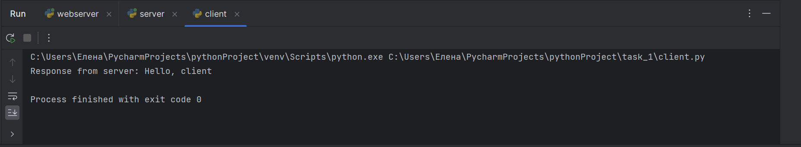

Цель: овладеть практическими навыками и умениями реализации web-серверов и
использования сокетов.
Оборудование: компьютерный класс.
Программное обеспечение: Python 2.7–3.6, библиотеки Python: sys, socket.

### Задание №1
Здесь код представляет собой простой пример клиент-серверного взаимодействия с использованием протокола UDP. Укажем пункты-пояснения того, что происходит на стороне сервера: 
1. Импортируется модуль socket. 
2. Определяется функция main(), которая будет выполнять основную логику сервера. 
3. Задается IP-адрес и порт сервера. 
4. Создается сокет сервера с помощью функции socket.socket(), указывая параметры AF_INET (IPv4) и SOCK_DGRAM (UDP). 
5. Связывается сокет сервера с заданным IP-адресом и портом с помощью метода bind(). 
6. Выводится сообщение о том, что сервер слушает на заданном IP-адресе и порту. 
7. В бесконечном цикле сервер принимает сообщение от клиента с помощью метода recvfrom(), указывая максимальный размер сообщения в байтах. 
8. Выводится сообщение от клиента, преобразованное из байтовой строки в строку с помощью метода decode(). 
9. Создается ответное сообщение для клиента. 
10. Ответное сообщение отправляется клиенту с помощью метода sendto(), преобразованное в байтовую строку с помощью метода encode().

Укажем пункты-пояснения того, что происходит на стороне клиента: 
1. Импортируется модуль socket.
2. Определяется функция main(), которая будет выполнять основную логику клиента. 
3. Задается IP-адрес и порт сервера. 
4. Задается сообщение, которое будет отправлено серверу. 
5. Создается сокет клиента с помощью функции socket.socket(), указывая параметры AF_INET (IPv4) и SOCK_DGRAM (UDP). 
6. Отправляется сообщение серверу с помощью метода sendto(), указывая сообщение в виде байтовой строки и адрес сервера. 
7. Получается ответное сообщение от сервера с помощью метода recvfrom(), указывая максимальный размер сообщения в байтах. 
8. Выводится ответное сообщение от сервера, преобразованное из байтовой строки в строку с помощью метода decode(). 
9. Закрывается сокет клиента. После определения функции main() на стороне клиента, проверяется, что код выполняется как самостоятельный скрипт, а не импортирован как модуль, и вызывается функция main(). import socket def main(): server_ip

    import socket
    
    
    def main():
        server_ip = "127.0.0.1"
        server_port = 12345
        message = "Hello, server"
    
        client_socket = socket.socket(socket.AF_INET, socket.SOCK_DGRAM)
        client_socket.sendto(message.encode(), (server_ip, server_port))
    
        response, _ = client_socket.recvfrom(1024)
        print("Response from server:", response.decode())
    
        client_socket.close()
    
    
    if __name__ == "__main__":
        main()
    
    import socket
    
    
    def main():
        server_ip = "127.0.0.1"
        server_port = 12345
    
        server_socket = socket.socket(socket.AF_INET, socket.SOCK_DGRAM)
        server_socket.bind((server_ip, server_port))
    
        print("Server is listening on", server_ip, "port", server_port)
    
        while True:
            message, client_address = server_socket.recvfrom(1024)
            print("Message from client:", message.decode())
    
            response = "Hello, client"
            server_socket.sendto(response.encode(), client_address)
    
    
    if __name__ == "__main__":
        main()

### Презентация результата
Для этого сначала запустим серверную часть, а затем клиентскую:

И клиент получает такое сообщение от сервера.

