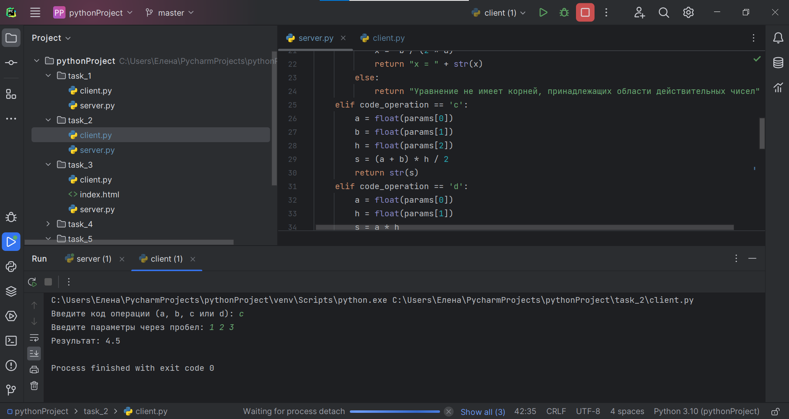

### Задание 2:

На стороне сервера:
1. Импортируется модуль socket.
2. Импортируется модуль math для выполнения математических операций.
3. Определяется функция process_request(), которая будет выполнять основную логику сервера. В этой функции происходит обработка различных операций (a, b, c, d) с заданными параметрами.
4. Создается сокет сервера с помощью функции socket.socket(), указывая параметры AF_INET (IPv4) и SOCK_STREAM (TCP).
5. Задается IP-адрес и порт сервера.
6. Связывается сокет сервера с заданным IP-адресом и портом с помощью метода bind().
7. Сокет сервера начинает слушать входящие подключения с помощью метода listen().
8. В бесконечном цикле сервер ожидает подключения клиента с помощью метода accept(). Когда клиент подключается, создается новый сокет клиента и адрес клиента.
9. Получается запрос от клиента с помощью метода recv(), указывая максимальный размер сообщения в байтах, и декодируется из байтовой строки в строку.
10. Запрос разбивается на операцию и параметры с помощью метода split().
11. Вызывается функция process_request() для обработки запроса и получения результата.
12. Результат преобразуется в строку и отправляется клиенту с помощью метода send(), преобразовав его в байтовую строку.
13. Сокет клиента закрывается.

На стороне клиента:
1. Импортируется модуль socket.
2. Определяется функция send_request(), которая будет выполнять основную логику клиента. В этой функции происходит отправка запроса на сервер и получение ответа.
3. Создается сокет клиента с помощью функции socket.socket(), указывая параметры AF_INET (IPv4) и SOCK_STREAM (TCP).
4. Задается IP-адрес и порт сервера.
5. Клиенту предлагается выюрать код операции и параметры, которые будут отправлены на сервер.
6. Устанавливается соединение с сервером с помощью метода connect(), указывая адрес сервера.
7. Запрос формируется в виде строки, кодируется в байтовую строку и отправляется серверу с помощью метода send().
8. Получается ответ от сервера с помощью метода recv(), указывая максимальный размер сообщения в байтах, и декодируется из байтовой строки в строку.
9. Сокет клиента закрывается. После определения функций на стороне клиента, проверяется, что код выполняется как самостоятельный скрипт, а не импортирован как модуль, и вызывается функция main().

    import socket
    import math
    
    
    def process_request(code_operation, params):
        if code_operation == 'a':
            a = float(params[0])
            b = float(params[1])
            c = math.sqrt(a ** 2 + b ** 2)
            return str(c)
        elif code_operation == 'b':
            a = float(params[0])
            b = float(params[1])
            c = float(params[2])
            d = b ** 2 - 4 * a * c
            if d > 0:
                x1 = (-b + math.sqrt(d)) / (2 * a)
                x2 = (-b - math.sqrt(d)) / (2 * a)
                return "x1 = " + str(x1) + ", x2 = " + str(x2)
            elif d == 0:
                x = -b / (2 * a)
                return "x = " + str(x)
            else:
                return "Уравнение не имеет корней, принадлежащих области действительных чисел"
        elif code_operation == 'c':
            a = float(params[0])
            b = float(params[1])
            h = float(params[2])
            s = (a + b) * h / 2
            return str(s)
        elif code_operation == 'd':
            a = float(params[0])
            h = float(params[1])
            s = a * h
            return str(s)
        else:
            return "Несуществующая операция"
    
    
    server_socket = socket.socket(socket.AF_INET, socket.SOCK_STREAM)
    
    server_address = ('localhost', 123)
    server_socket.bind(server_address)
    
    server_socket.listen(1)
    
    while True:
        print("Ожидание подключения клиента...")
        client_socket, client_address = server_socket.accept()
    
        print("Подключение от", client_address)
    
        request = client_socket.recv(1024).decode()
        operation, *parameters = request.split()
    
        result = process_request(operation, parameters)
    
        client_socket.send(result.encode())
    
        client_socket.close()
    
    import socket
    
    
    def send_request(operate, params):
    
        client_socket = socket.socket(socket.AF_INET, socket.SOCK_STREAM)
    
        server_address = ('localhost', 123)
        client_socket.connect(server_address)
    
        request = operate + ' ' + ' '.join(params)
        client_socket.send(request.encode())
    
        response = client_socket.recv(1024).decode()
    
        client_socket.close()
    
        return response
    
    
    operation = input("Введите код операции (a, b, c или d): ")
    parameters = input("Введите параметры через пробел: ").split()
    
    result = send_request(operation, parameters)
    
    print("Результат:", result)
    
### Презентация результата

