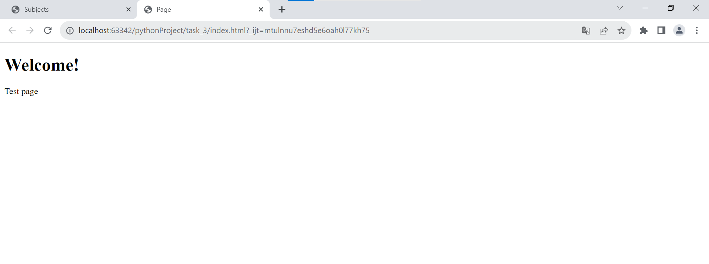
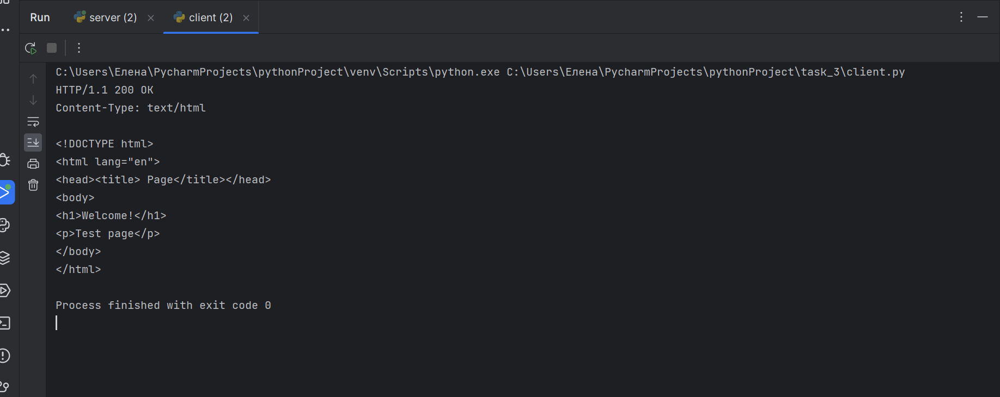

 ### Задание 3: 
Код представляет собой пример простого веб-сервера. На стороне сервера: Импортируется модуль socket. Затем определяется функция process_request(), которая будет выполнять основную логику сервера. В данном случае функция открывает файл "index.html" и читает его содержимое. Затем формируется HTTP-ответ с кодом 200 OK и типом контента text/html, добавляется содержимое файла и возвращается ответ. После создается сокет сервера с помощью функции socket.socket(), указывая параметры AF_INET (IPv4) и SOCK_STREAM (TCP). Задается IP-адрес и порт сервера. Сокет сервера связывается с заданным IP-адресом и портом с помощью метода bind() и начинает слушать входящие подключения с помощью метода listen(). В бесконечном цикле сервер ожидает подключения клиента с помощью метода accept(). Когда клиент подключается, создается новый сокет клиента и адрес клиента. Принимается запрос от клиента с помощью метода recv(), указывая максимальный размер сообщения в байтах, и декодируется из байтовой строки в строку. Вызывается функция process_request() для обработки запроса и получения результата. Результат преобразуется в байтовую строку и отправляется клиенту с помощью метода send(). Сокет клиента закрывается. На стороне клиента: Сперва импортируется модуль socket. После cоздается сокет клиента с помощью функции socket.socket(), указывая параметры AF_INET (IPv4) и SOCK_STREAM (TCP).
Задается IP-адрес и порт сервера и формируется запрос в виде строки, содержащей HTTP-запрос на получение главной страницы сайта "localhost". Устанавливается соединение с сервером с помощью метода connect(), указывая адрес сервера. Запрос кодируется в байтовую строку и отправляется серверу с помощью метода send(). Получается ответ от сервера с помощью метода recv(), указывая максимальный размер сообщения в байтах, и декодируется из байтовой строки в строку. Ответ выводится на экран. Сокет клиента закрывается. В данном коде сервер просто возвращает содержимое файла "index.html" при получении любого запроса от клиента. Клиент отправляет HTTP-запрос на получение главной страницы сайта и выводит ответ на экран. import socket

import socket

client_socket = socket.socket(socket.AF_INET, socket.SOCK_STREAM)

server_address = ('localhost', 1245)
client_socket.connect(server_address)

request = "GET / HTTP/1.1\r\nHost: localhost\r\n\r\n"
client_socket.send(request.encode())

response = client_socket.recv(1024).decode()

print(response)

client_socket.close()

import socket

def process_request():

    with open('index.html', 'r') as file:
        html = file.read()

    response = "HTTP/1.1 200 OK\r\nContent-Type: text/html\r\n\r\n" + html

    return response

server_socket = socket.socket(socket.AF_INET, socket.SOCK_STREAM)

server_address = ('localhost', 1245)
server_socket.bind(server_address)

server_socket.listen(1)

while True:
    print("Ожидание подключения клиента...")
    client_socket, client_address = server_socket.accept()

    print("Подключение от", client_address)

    request = client_socket.recv(1024).decode()

    response = process_request()

    client_socket.send(response.encode())

    client_socket.close()

Клиентская часть написана в доказательство, что клиент увидит сайт.

