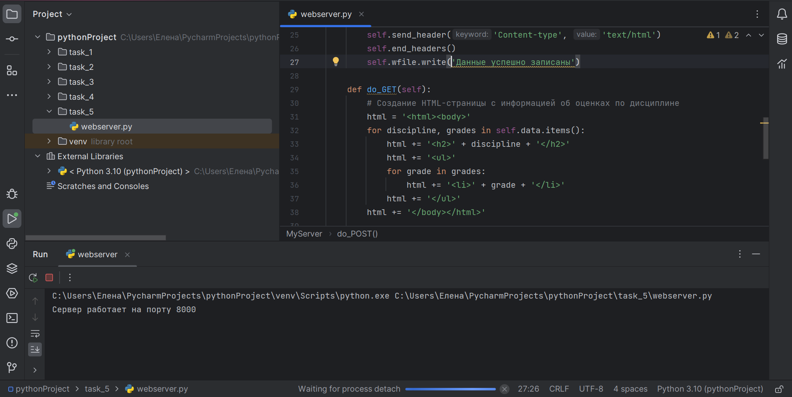
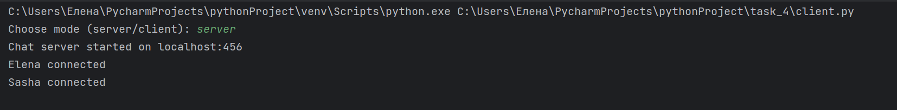
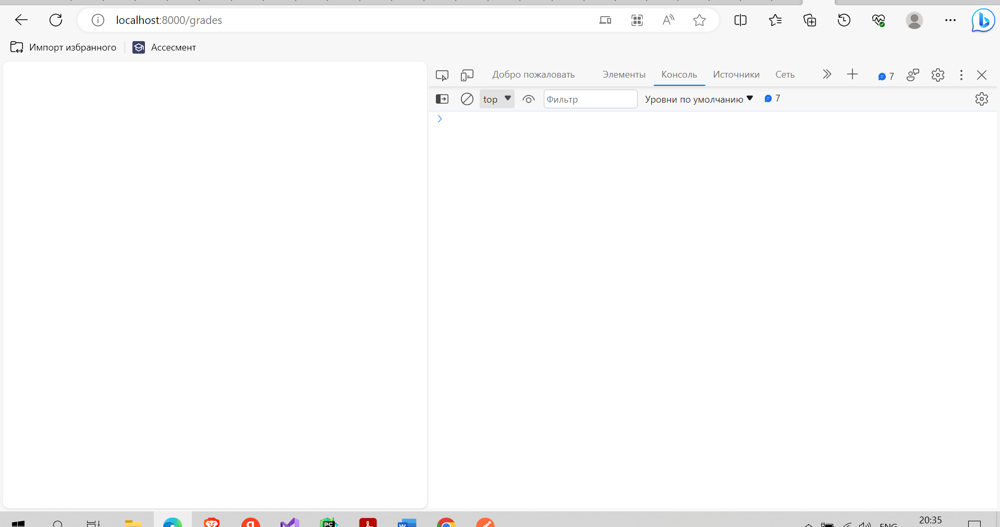
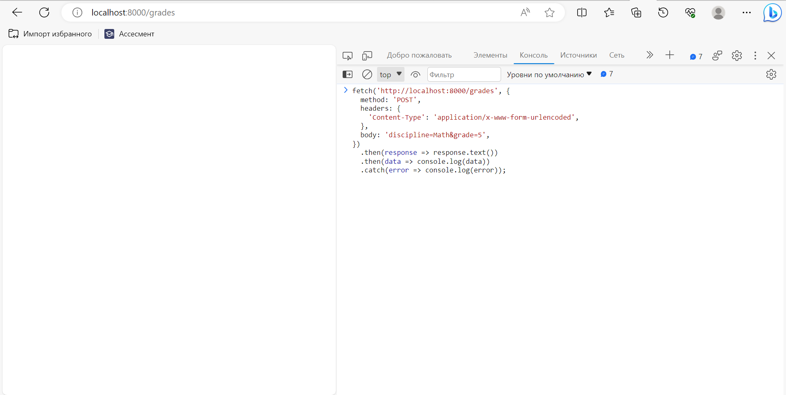
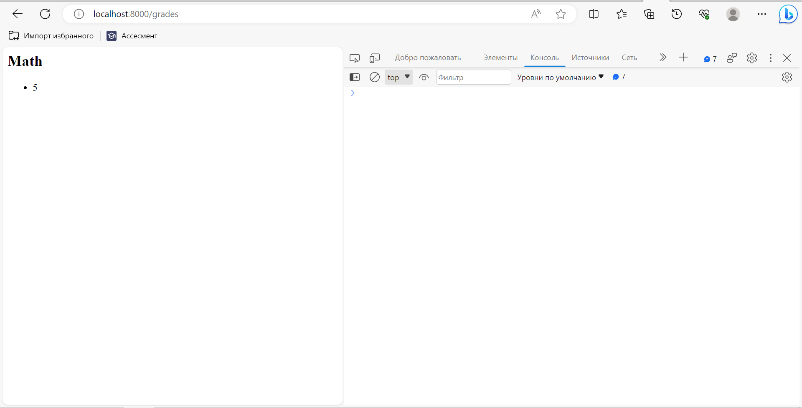

Задание 5: 
Данный код представляет собой простой HTTP-сервер, который может принимать POST-запросы и GET-запросы. 
1. Импортируется класс BaseHTTPRequestHandler и класс HTTPServer из модуля http.server. 
2. Создается класс MyServer, который наследуется от BaseHTTPRequestHandler. В этом классе определены два метода: do_POST и do_GET. 
3. Метод do_POST используется для обработки POST-запросов. Сначала получается длина тела запроса из заголовка Content-Length. Затем данные запроса считываются из потока
чтения rfile и декодируются из байтовой строки в строку с помощью метода decode('utf-8'). 
4. Полученные данные разделяются на две части: дисциплину и оценку. Для этого используется метод split('&'), который разделяет строку по символу '&'. Затем каждая часть разделяется по символу '=' с помощью метода split('=')[1]. 
5. Данные записываются в словарь self.data. Если дисциплина уже существует в словаре, то оценка добавляется в список оценок для этой дисциплины. Если дисциплины нет в словаре, то создается новая запись с ключом дисциплины и значением - список оценок. 
6. После записи данных в словарь, сервер отправляет успешный ответ с кодом 200 и заголовком 'Content-type', 'text/html'. Затем в поток записи wfile отправляется строка 'Данные записаны'. 
7. Метод do_GET используется для обработки GET-запросов. Сначала создается HTML-страница, которая содержит информацию об оценках по каждой дисциплине. Для этого происходит итерация по словарю self.data. Для каждой дисциплины создается заголовок h3, затем создается маркированный список ul, в котором перечисляются оценки для данной дисциплины. 
8. После создания HTML-страницы, сервер отправляет успешный ответ с кодом 200 и заголовком 'Content-type', 'text/html'. Затем в поток записи wfile отправляется сгенерированная HTML-страница, закодированная в байтовую строку с помощью метода encode('utf-8'). 
9. В конце определен метод run, который запускает HTTP-сервер на указанном порту (по умолчанию 6332). Создается экземпляр класса HTTPServer с указанными адресом сервера и классом обработчика запросов. Затем вызывается метод serve_forever() для бесконечного обслуживания запросов. 
10. В конце кода вызывается функция run() для запуска сервера.

    from http.server import BaseHTTPRequestHandler, HTTPServer
    
    
    class MyServer(BaseHTTPRequestHandler):
      #Словарь для хранения информации о дисциплине и оценках
        data = {}
    
        def do_POST(self):
            # Получение данных из POST-запроса
            content_length = int(self.headers['Content-Length'])
            post_data = self.rfile.read(content_length).decode('utf-8')
    
            # Разделение данных на дисциплину и оценку
            discipline, grade = post_data.split('&')
            discipline = discipline.split('=')[1]
            grade = grade.split('=')[1]
    
            # Запись данных в словарь
            if discipline not in self.data:
                self.data[discipline] = []
            self.data[discipline].append(grade)
    
            # Отправка успешного ответа
            self.send_response(200)
            self.send_header('Content-type', 'text/html')
            self.end_headers()
            self.wfile.write('Данные записаны')
    
        def do_GET(self):
            # Создание HTML-страницы с информацией об оценках по дисциплине
    
            html = '<html><body>'
            for discipline, grades in self.data.items():
                html += '<h3>' + discipline + '</h3>'
                html += '<ul>'
                for grade in grades:
                    html += '<li>' + grade + '</li>'
                html += '</ul>'
            html += '</body></html>'
    
            # Отправка HTML-страницы
            self.send_response(200)
            self.send_header('Content-type', 'text/html')
            self.end_headers()
            self.wfile.write(html.encode('utf-8'))
    
    
    def run(server_class=HTTPServer, handler_class=MyServer, port=6332):
        server_address = ('', port)
        httpd = server_class(server_address, handler_class)
        print('Сервер работает на порте', port)
        httpd.serve_forever()
    
    
    run()

