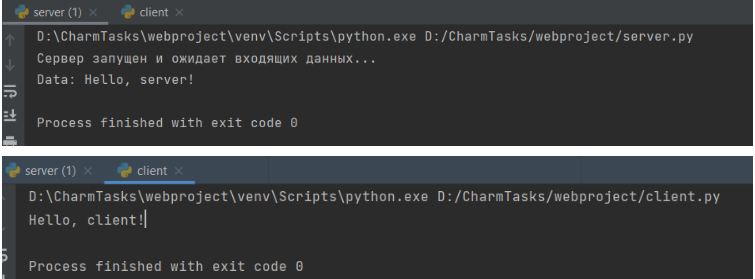

##Задание 1
Реализовать клиентскую и серверную часть приложения. Клиент отсылает серверу
    сообщение «Hello, server». Сообщение должно отразиться на стороне сервера.
    Сервер в ответ отсылает клиенту сообщение «Hello, client». Сообщение должно
    отобразиться у клиента.
    Обязательно использовать библиотеку socket
    Реализовать с помощью протокола UDP

##Сервер
    import socket
    
    
    def main():
        sock = socket.socket(socket.AF_INET, socket.SOCK_DGRAM)  # создание сокета
        sock.bind(('localhost', 9090))  # связь сокета с хостом и портом
        print("Сервер запущен и ожидает входящих данных...")
    
        data, addr = sock.recvfrom(1024)  # новый сокет и адрес клиента
        if data:
            udata = data.decode('utf-8')  # декодирование строки
            print("Data: " + udata)
            reply_msg = "Hello, client!"
            sock.sendto(reply_msg.encode('utf-8'), addr)
    
        sock.close()
    
    
    if __name__ == "__main__":
        main()

##Клиент
    import socket
    
    
    def main():
        sock = socket.socket(socket.AF_INET, socket.SOCK_DGRAM)  # создание сокета
        sock.sendto(b'Hello, server!', ('localhost', 9090))
    
        data, addr = sock.recvfrom(1024)
        sock.close()
        print(data.decode('utf-8'))
    
    
    if __name__ == "__main__":
        main()

###Пример работы
