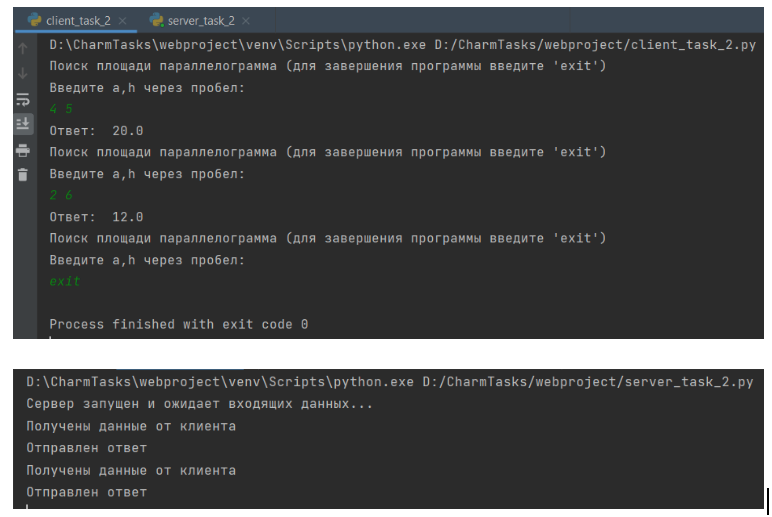

##Задание 2
Реализовать клиентскую и серверную часть приложения. Клиент запрашивает у
сервера выполнение математической операции, параметры, которые вводятся с
клавиатуры. Сервер обрабатывает полученные данные и возвращает результат
клиенту. Вариант: Поиск площади параллелограмма.
Обязательно использовать библиотеку socket
Реализовать с помощью протокола TCP

##Сервер
    import json
    import socket
    
    
    def get_parallelogram_area(a, h):
        s = a * h
        return s
    
    
    def main():
        sock = socket.socket(socket.AF_INET, socket.SOCK_STREAM)  # создание сокета
        sock.bind(('localhost', 1356))  # связь сокета с хостом и портом
        print("Сервер запущен и ожидает входящих данных...")
        sock.listen(5)
    
        while True:
            try:
                client_socket, addr = sock.accept()  # новый сокет и адрес клиента
                data = client_socket.recv(1024)
    
                if data != "":
                    udata = json.loads(data.decode('utf-8'))  # декодирование строки
                    a = udata.get('a')
                    h = udata.get('h')
                    print("Получены данные от клиента")
                    reply_msg = get_parallelogram_area(a, h)
                    reply_msg_bytes = str(reply_msg).encode('utf-8')
                    client_socket.send(reply_msg_bytes)
                    print("Отправлен ответ")
    
            except KeyboardInterrupt:
                sock.close()
                print("Соединение закрыто")
    
    
    if __name__ == "__main__":
        main()

##Клиент
    import json
    import socket
    
    
    def main():
        while True:
            try:
                mes = input("Поиск площади параллелограмма (для завершения программы введите 'exit')\nВведите a,"
                            "h через пробел:\n")
                if mes.lower() == 'exit':
                    break  # Выход из цикла при вводе 'exit'
    
                a, h = list(map(float, mes.split(" ")))  # ввод параметров
            except:
                print("Неверный ввод")
                continue
    
            with socket.socket(socket.AF_INET, socket.SOCK_STREAM) as sock:  # создание сокета
                sock.connect(('localhost', 1356))
                sock.send(bytes(json.dumps({"a": a, "h": h}), "utf-8"))  # отправка параметров
                data = sock.recv(1000).decode('utf-8')  # принятие и расшифровка ответа
                if not data:
                    break
                print("Ответ: ", data)
    
    
    if __name__ == "__main__":
        main()_

###Пример работы
