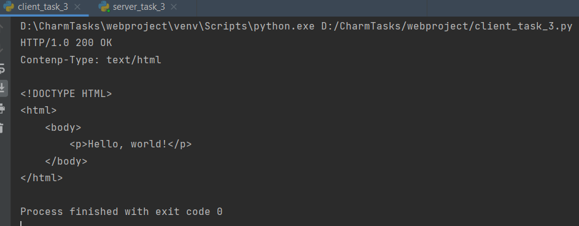

##Задание 3
Реализовать серверную часть приложения. Клиент подключается к серверу. В ответ
клиент получает http-сообщение,содержащее html-страницу, которую сервер
подгружает из файла index.html. 
Обязательно использовать библиотеку socket.

##Сервер
    import socket
    
    
    def main():
        sock = socket.socket(socket.AF_INET, socket.SOCK_STREAM)  # создание сокета
        sock.bind(('localhost', 555))  # связь сокета с хостом и портом
        print('Сервер запущен и ожидает входящих данных...')
        sock.listen(5)
    
        while True:
            try:
                client, addr = sock.accept()
                client.recv(1000)
                response_type = 'HTTP/1.0 200 OK\n'
                headers = 'Contenp-Type: text/html\n\n'
                with open("index.html", "r") as f:
                    body = f.read()
                res = response_type + headers + body
                client.send(res.encode('utf-8'))
                client.close()
            except KeyboardInterrupt:
                sock.close()
    
    
    
    if __name__ == "__main__":
        main()

##Клиент
    import socket
    
    
    def main():
        sock = socket.socket(socket.AF_INET, socket.SOCK_STREAM)  # создание сокета
        sock.connect(('localhost', 555))
        sock.send(b'Hello, server!')
        data = sock.recv(1024).decode('utf-8')
        print(data)
        sock.close()
    
    
    if __name__ == "__main__":
        main()

###Пример работы
