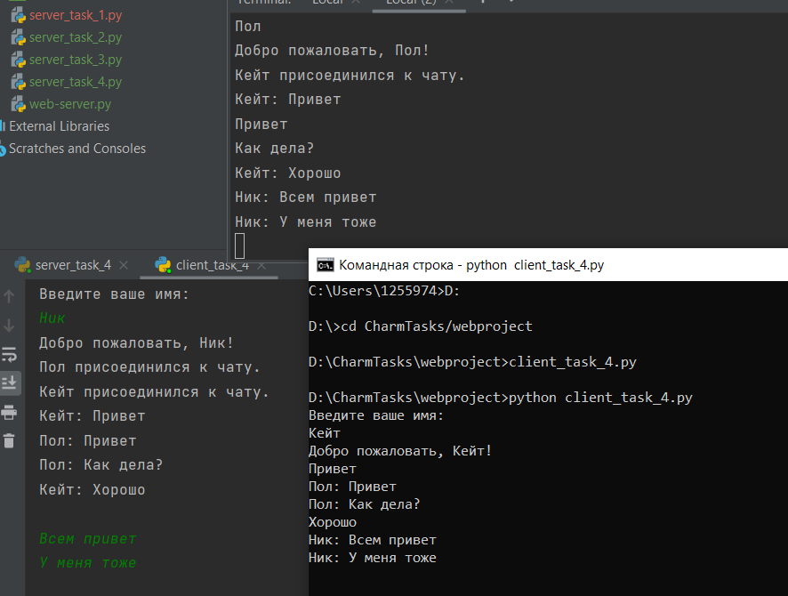

##Задание 4
Реализовать многопользовательский чат. Реализация
многопользовательского часа позволяет получить максимальное количество
баллов.
Обязательно использовать библиотеку socket. Реализовать с помощью протокола TCP – 100% баллов, с помощью UDP – 80%.
Обязательно использовать библиотеку threading.
Для реализации с помощью UDP, thearding использовать для получения
сообщений у клиента.
Для применения с TCP необходимо запускать клиентские подключения И прием
и отправку сообщений всем юзерам на сервере в потоках. Не забудьте сохранять юзеров,
чтобы потом отправлять им сообщения.

##Сервер
    import socket
    import threading
    
    server = socket.socket(socket.AF_INET, socket.SOCK_STREAM)
    
    host = '0.0.0.0'  # все доступные интерфейсы
    port = 1221
    server.bind((host, port))
    
    clients = {}
    
    chat_lock = threading.Lock()  # блокировка для обеспечения безопасного доступа к чату
    
    
    def handle_client(client_socket, client_address):  # функция для обработки сообщений от клиентов
        client_socket.send("Введите ваше имя: ".encode())
        username = client_socket.recv(1024).decode()
    
        welcome_message = f"Добро пожаловать, {username}!"
        client_socket.send(welcome_message.encode())
    
        notification = f"{username} присоединился к чату."
        mailing(notification, client_socket)
    
        with chat_lock:
            clients[client_socket] = username
    
        while True:
            try:
                message = client_socket.recv(1024).decode()
                if not message:
                    break
                mailing(f"{username}: {message}", client_socket)
            except:
                break
    
        with chat_lock:  # если клиент отключается, то удаляем его из списка и уведомляем остальных
            del clients[client_socket]
        client_socket.close()
        leave_message = f"{username} покинул чат."
        mailing(leave_message, client_socket)
    
    
    def mailing(message, sender_socket):
        with chat_lock:
            for client_socket in clients:
                if client_socket != sender_socket:
                    try:
                        client_socket.send(message.encode())
                    except:
                        client_socket.close()
                        del clients[client_socket]
    
    
    def main():
        server.listen(5)
        print(f"Сервер запущен на {host}:{port}")
    
        while True:
            client_socket, client_address = server.accept()
            client_handler = threading.Thread(target=handle_client, args=(client_socket, client_address))
            client_handler.start()
    
    
    if __name__ == "__main__":
        main()

##Клиент
    import socket
    import threading
    
    
    def send_message(client_socket):
        while True:
            message = input()
            client_socket.send(message.encode())
    
    
    def receive_message(client_socket):
        while True:
            try:
                message = client_socket.recv(1024).decode()
                print(message)
            except:
                print("Ошибка при получении сообщения")
                break
    
    
    def main():
        host = 'localhost'
        port = 1221
    
        client = socket.socket(socket.AF_INET, socket.SOCK_STREAM)
        client.connect((host, port))
    
        send_thread = threading.Thread(target=send_message, args=(client,))
        receive_thread = threading.Thread(target=receive_message, args=(client,))
    
        send_thread.start()
        receive_thread.start()
    
    
    if __name__ == "__main__":
        main()

###Пример работы
