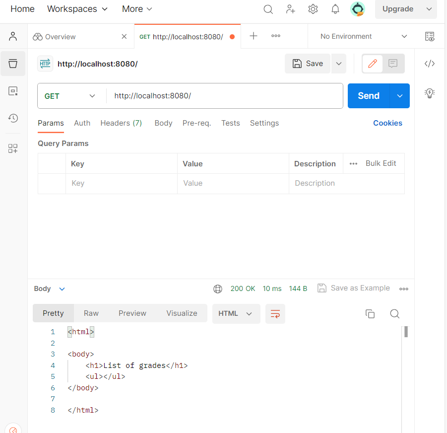

##Задание 5
Необходимо написать простой web-сервер для обработки GET и POST http
запросов средствами Python и библиотеки socket.
Задание: сделать сервер, который может:
Принять и записать информацию о дисциплине и оценке по дисциплине.
Отдать информацию обо всех оценах по дсициплине в виде html-страницы.
##Сервер
    import socket
    import urllib.parse
    
    
    class MyHTTPServer:
        def __init__(self, host, port, server_name):
            self._host = host
            self._port = port
            self._server_name = server_name
            self.grades = []
            self.disciplines = []
    
        def serve_forever(self):
            serv_sock = socket.socket(
                socket.AF_INET,
                socket.SOCK_STREAM,
                proto=0
            )
    
            try:
                serv_sock.bind((self._host, self._port))
                serv_sock.listen()
    
                while True:
                    conn, _ = serv_sock.accept()
                    try:
                        self.serve_client(conn)
                    except Exception as e:
                        print('Client serving failed', e)
            finally:
                serv_sock.close()
    
        def serve_client(self, conn):
            try:
                req = self.parse_request(conn)
                resp = self.handle_request(req)
                self.send_response(conn, resp)
            except ConnectionResetError:
                conn = None
            except Exception as e:
                self.send_error(conn, e)
    
            if conn:
                conn.close()
    
        def parse_request(self, conn):
            req_data = b''
            while b'\r\n\r\n' not in req_data:
                data = conn.recv(1024)
                if not data:
                    break
                req_data += data
    
            if not req_data:
                raise ValueError('Invalid request')
    
            request_lines = req_data.decode('utf-8').split('\r\n')
            method, path, _ = request_lines[0].split(' ')
    
            headers = {}
            for line in request_lines[1:]:
                if ':' in line:
                    key, value = line.split(':', 1)
                    headers[key.strip()] = value.strip()
    
            params = {}
            if method == 'POST':
                post_data = request_lines[-1]
                params = urllib.parse.parse_qs(post_data)
    
            return HTTPRequest(method, path, headers, params)
    
        def handle_request(self, req):
            if req.method == 'GET':
                if req.path == '/':
                    resp_body = '<html><body><h1>List of grades</h1><ul>{}</ul></body></html>'
                    items = ''.join('<li>{} - {}</li>'.format(discipline, grade) for discipline, grade in
                                    zip(self.disciplines, self.grades))
                    resp_body = resp_body.format(items)
                    return self.create_response(200, 'OK', resp_body)
                else:
                    return self.create_response(404, 'Not Found', 'Page not found')
            elif req.method == 'POST':
                if req.path == '/record':
                    grade = req.params.get("grade")
                    discipline = req.params.get("discipline")
                    if grade and discipline:
                        self.grades.append(grade[0])
                        self.disciplines.append(discipline[0])
                        return self.create_response(200, 'OK', 'Record saved')
                    else:
                        return self.create_response(400, 'Bad Request', 'Missing grade or discipline')
                else:
                    return self.create_response(404, 'Not Found', 'Page not found')
    
        def create_response(self, code, text, body):
            resp = f"HTTP/1.1 {code} {text}\r\n"
            resp += f"Server: {self._server_name}\r\n"
            resp += "Content-Type: text/html\r\n"
            resp += f"Content-Length: {len(body)}\r\n"
            resp += "\r\n"
            resp += body
    
            return resp.encode('utf-8')
    
        def send_response(self, conn, resp):
            conn.sendall(resp)
    
        def send_error(self, conn, err):
            err_msg = f"HTTP/1.1 500 Internal Server Error\r\n\r\nError: {err}"
            conn.sendall(err_msg.encode('utf-8'))
    
    
    class HTTPRequest:
        def __init__(self, method, path, headers, params):
            self.method = method
            self.path = path
            self.headers = headers
            self.params = params
    
    
    if __name__ == '__main__':
        host = 'localhost'
        port = 8080
        name = 'MyHTTPServer'
    
        serv = MyHTTPServer(host, port, name)
        print("Сервер запущен на", port)
        try:
            serv.serve_forever()
        except KeyboardInterrupt:
            pass

###Пример работы

