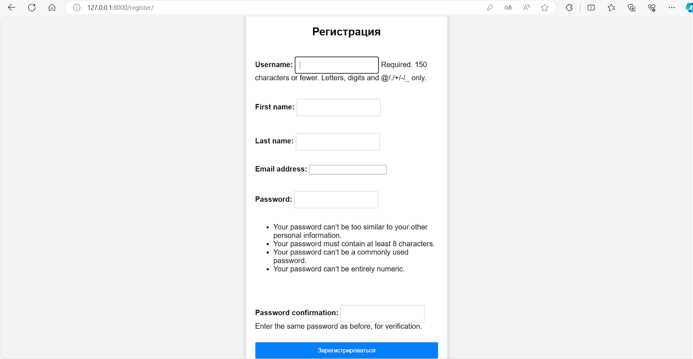
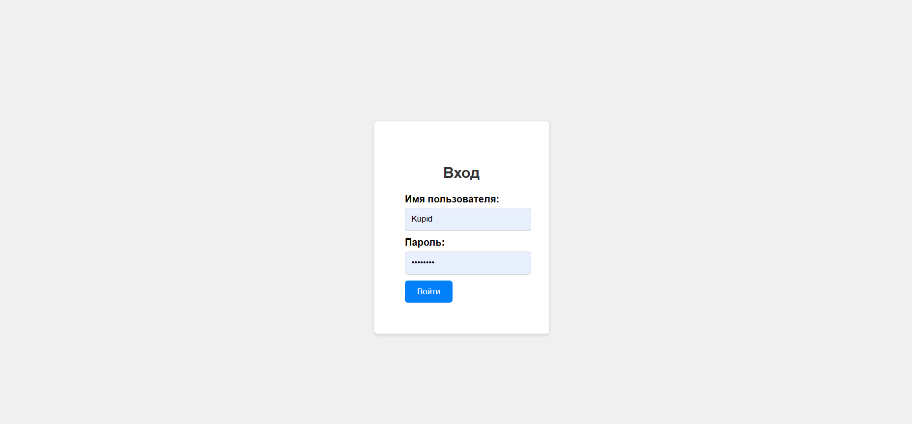
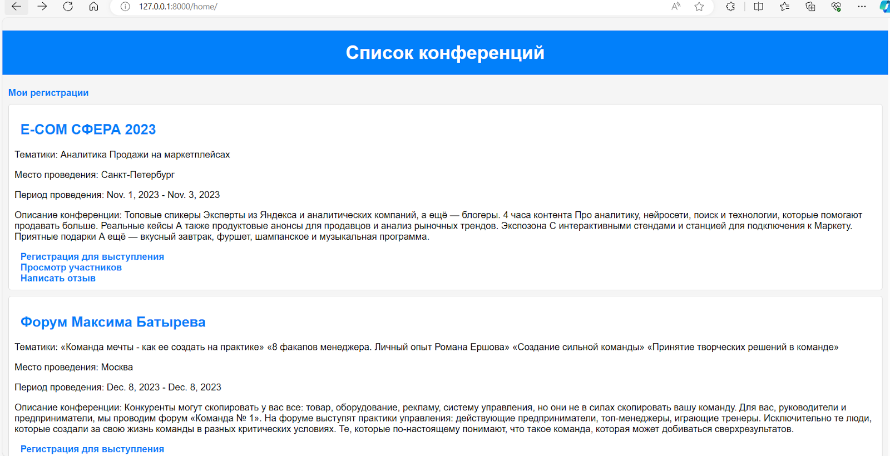
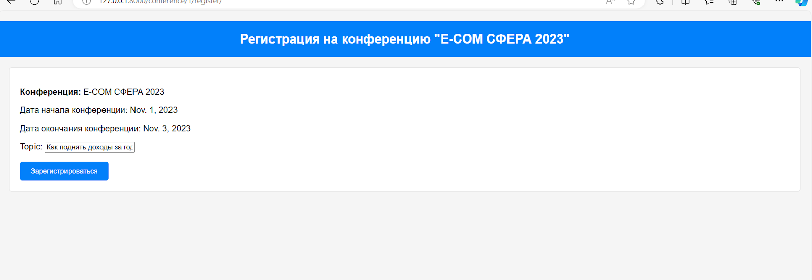
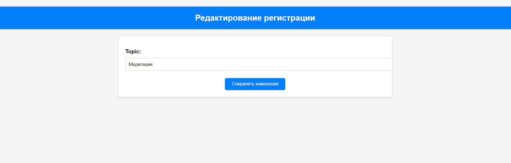
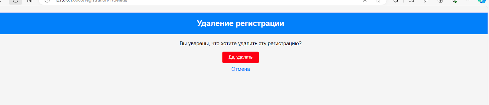
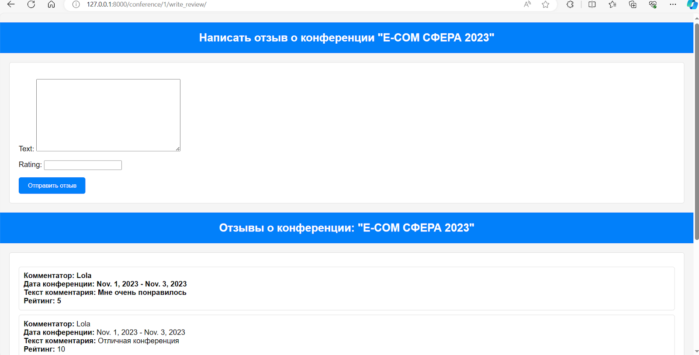
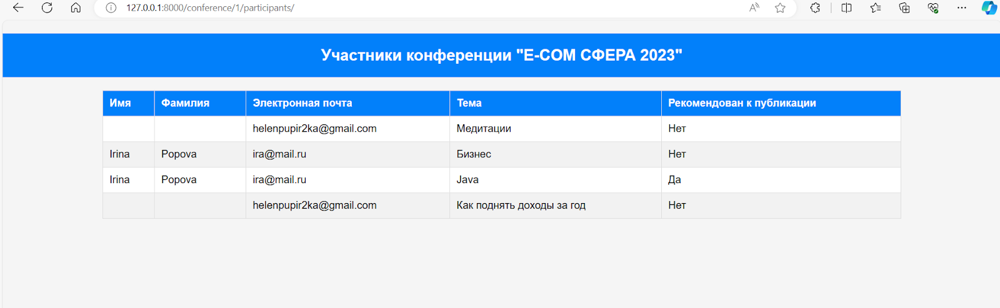
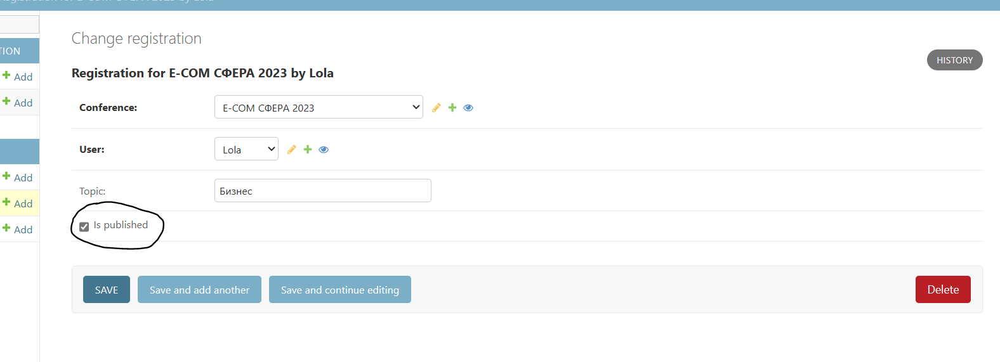

#Работа веб-сервиса

По варианту №5 мне нужно было реализовать веб-сервис "Список научных конференций"

Интерфейс каждой конференции описывает ее название, список тематик, место проведения,
период проведения, описание конференций, описание место проведения, условия участия.

###Функционал сервиса состоит из следующих пунктов:

1. Регистрация  нового пользователя в системе

2. Вход в систему уже существующего пользователя

3. Просмотр конференций 

4. Регистрация авторов для выступлений

5. Возможность редактирования своих регистраций 

6. Возможность удаления своих регистраций 

7. Написание отзывов к конференциям 

8. Просмотр списка участников конференции

9. Возможность администратора указания результатов
выступления (рекомендован к публикации или нет)

