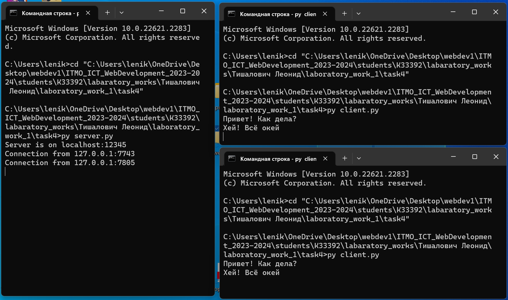

# Задание 4

Реализовать двухпользовательский или многопользовательский чат. Реализация
многопользовательского часа позволяет получить максимальное количество
баллов.

Обязательно использовать библиотеку threading

## Ход выполнения работы

### Код server.py

    import socket
    import threading

    server_address = ('localhost', 12345)

    server_socket = socket.socket(socket.AF_INET, socket.SOCK_STREAM)

    server_socket.bind(server_address)

    server_socket.listen(5)

    clients = []

    def handle_client(client_socket):
        while True:
            try:
                message = client_socket.recv(1024).decode('utf-8')
                if not message:
                    break

                for client in clients:
                    if client != client_socket:
                        client.send(message.encode('utf-8'))
            except:
                break

        clients.remove(client_socket)
        client_socket.close()

    print("Server is on {}:{}".format(server_address[0], server_address[1]))

    while True:
        client_socket, client_address = server_socket.accept()
        print("Connection from {}:{}".format(client_address[0], client_address[1]))

        clients.append(client_socket)

        client_thread = threading.Thread(
            target=handle_client, args=(client_socket,))
        client_thread.start()

## Код client.py

    import socket
    import threading

    server_address = ('localhost', 12345)

    client_socket = socket.socket(socket.AF_INET, socket.SOCK_STREAM)

    client_socket.connect(server_address)

    def receive_messages():
        while True:
            try:
                message = client_socket.recv(1024).decode('utf-8')
                print(message)
            except:
                break

    receive_thread = threading.Thread(target=receive_messages)
    receive_thread.start()

    while True:
        message = input()
        client_socket.send(message.encode('utf-8'))

## Результат

