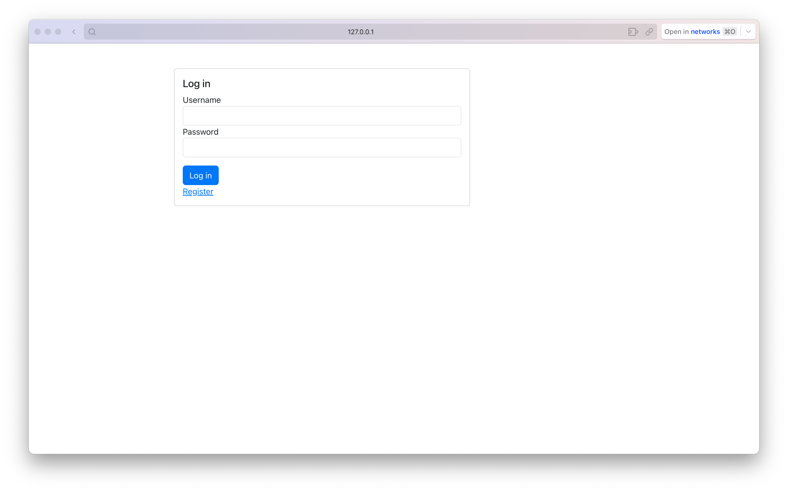
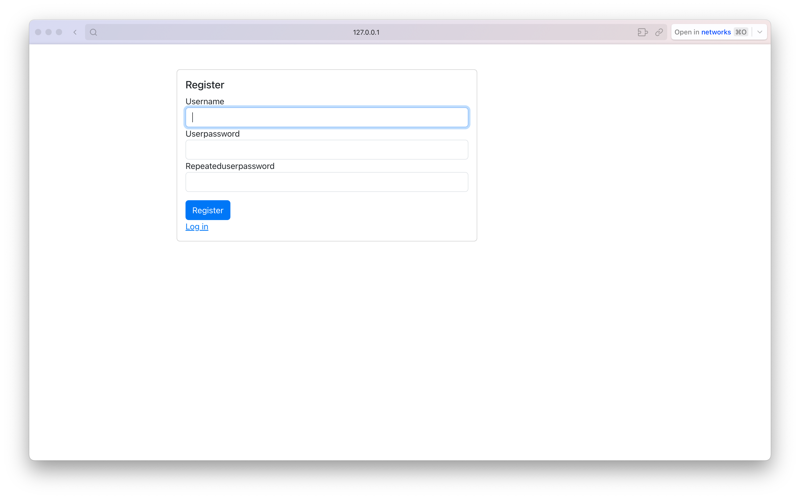
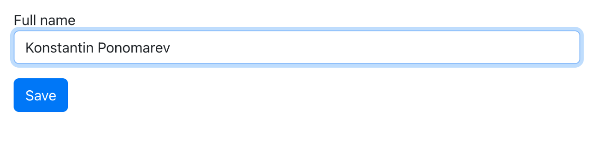
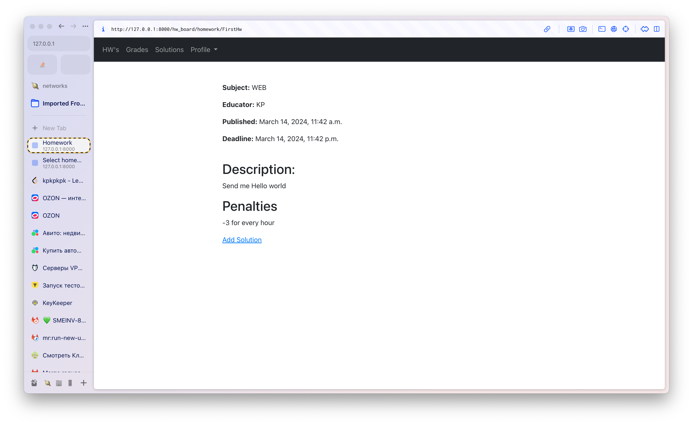
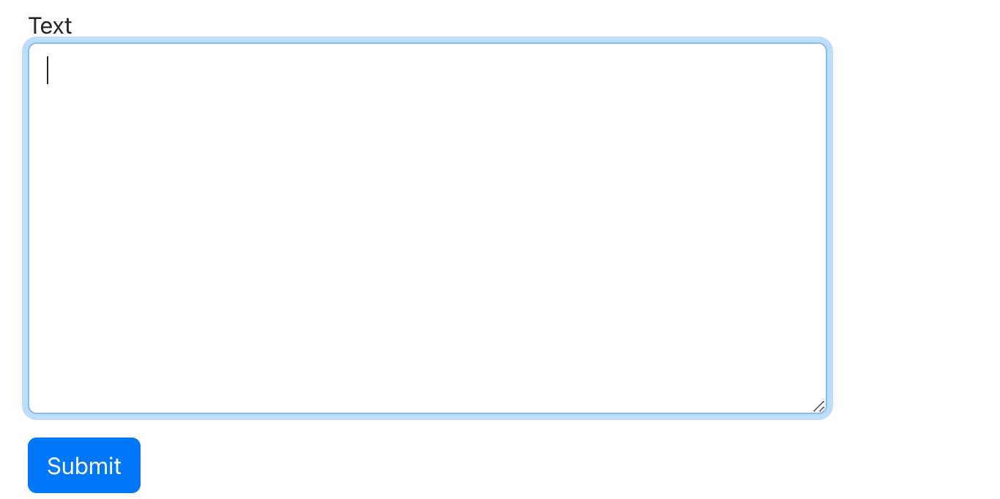
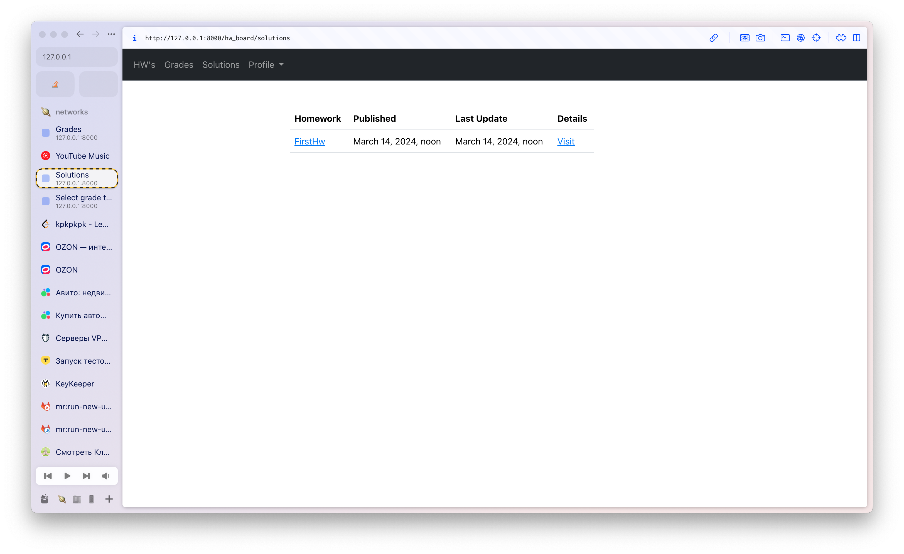
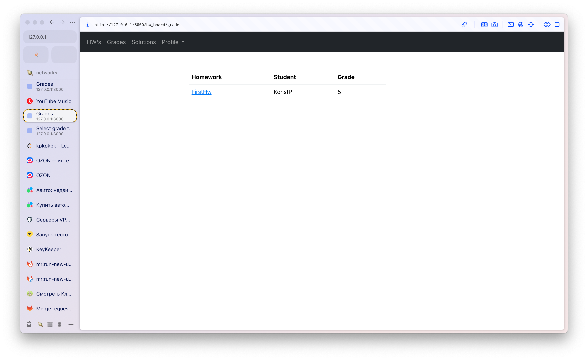
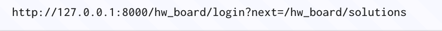

# Лабораторная работа №2

## Доска домашних заданий

О домашнем задании должна храниться следующая информация: предмет,
преподаватель, дата выдачи, период выполнения, текст задания, информация о штрафах.
Необходимо реализовать следующий функционал:

* Регистрация новых пользователей.

* Просмотр домашних заданий по всем дисциплинам (сроки выполнения,
  описание задания).

* Сдача домашних заданий в текстовом виде.

* Администратор (учитель) должен иметь возможность поставить оценку за
  задание средствами Django-admin.

* В клиентской части должна формироваться таблица, отображающая оценки
  всех учеников класса.

## Страницы

Все страницы за исключением страницы входа и регистрации имеют ограниченный доступ, требующий авторизации

### Страница входа:

На странице входа присутствуют два поля: ввод логина пользователя и его пароль.
Помимо этого пользователь может перейти к странице регистрации, если ранее не делал этого

### Страница регистрации:

На странице регистрации видно поля, в которых пользователю нужно придумать никнейм, а также задать пароли,
по нажатию на кнопку мы переходим сразу же на главную страницу.

### Страница смены именя (страничка где можно ввести имя):

Добавлен функционал в котором можно спокойно сменить имя на любое доступное

### Главная с домашками :

На этой странице (Hw's) представлена таблица в которой отображаются все домашние задания, предмет, учитель, время, когда
была опубликована дз и дедлайн

### Детали дз:

На деталях видно все то же самое, что и в таблице, но добавляется поле с описанием и штрафами
Также присутствует кнопка добавления ответа

### Поле ответа:

нажав на которую мы попадаем на страницу ввода текста. Ее можно было оформить по-разному, но я выбрал самый простой
путь: просто создав новую страницу,
хотя можно было ее и встроить в детали дз

### Таблица решений домашек:

После ввода решений, оно сразу отображается в Solutions, в котором можно посмотреть все свои ответы и подредактировать
их

### Таблица с оценками:

Оценки выставляет преподаватель, а студенты могут просматривать их

### Попытка неавторизованного доступа

При попытке неавторизованного доступа клиента перебрасывает на страницу входа, при этом после входа сразу роутит на ту
страницу, с откуда пытались получить доступ

## Код решения

### models.py

    from django.db import models
    from django.contrib.auth.models import User
    
    
    class Subject(models.Model):
        name = models.CharField(max_length=150)
    
    
    class Teacher(models.Model):
        full_name = models.CharField(max_length=150)
    
    
    class Student(models.Model):
        user = models.OneToOneField(User, on_delete=models.CASCADE)
        full_name = models.CharField(max_length=150)
    
    
    class Homework(models.Model):
        slug = models.CharField(max_length=50, unique=True)
        subject = models.ForeignKey(Subject, on_delete=models.CASCADE)
        teacher = models.ForeignKey(Teacher, on_delete=models.CASCADE)
        published = models.DateTimeField(auto_now_add=True)
        deadline = models.DateTimeField()
        description = models.TextField()
        penalties = models.TextField()
    
    
    class Solution(models.Model):
        student = models.ForeignKey(Student, on_delete=models.CASCADE)
        homework = models.ForeignKey(Homework, on_delete=models.CASCADE)
        published = models.DateTimeField(auto_now_add=True)
        last_update = models.DateTimeField(auto_now=True)
        text = models.TextField()
    
    
    class Grade(models.Model):
        student = models.ForeignKey(Student, on_delete=models.CASCADE)
        homework = models.ForeignKey(Homework, on_delete=models.CASCADE)
        grade = models.IntegerField(choices=[(5, 'Great'), (4, 'Good'), (3, 'Descent'), (2, 'Poor')])

### views.py

    from django.shortcuts import render, redirect, get_object_or_404
    from django.views.generic import View
    from django.utils.decorators import method_decorator
    
    from django.contrib.auth import authenticate, login, logout
    from django.contrib.auth.decorators import login_required
    
    from .models import *
    from .forms import *
    from .utils import *
    
    
    class Home(View):
        def get(self, request):
            return redirect('login_url')
    
    
    @method_decorator(login_required, name='dispatch')
    class HomeworksList(View):
        def get(self, request):
            homeworks = Homework.objects.all()
            return render(request, 'board/homeworks_list.html', {'homeworks': homeworks})
    
    
    @method_decorator(login_required, name='dispatch')
    class HomeworkDetail(View):
        def get(self, request, slug):
            homework = get_object_or_404(Homework, slug=slug)
            return render(request, 'board/homework_detail.html', {'homework': homework})
    
    
    class UserLogin(View):
        def get(self, request):
            form = CustomAuthenticationForm()
            return render(request, 'board/user_login.html', {'form': form})
    
        def post(self, request):
            form = CustomAuthenticationForm(request=request, data=request.POST)
            if not form.is_valid():
                return render(request, 'board/user_login.html', {'form': form})
            username = form.cleaned_data['username']
            password = form.cleaned_data['password']
            user = authenticate(username=username, password=password)
            if not user:
                return render(request, 'board/user_login.html', {'form': form})
            login(request, user)
            return redirect('profile_url')
    
    
    @method_decorator(login_required, name='dispatch')
    class UserLogout(View):
        def get(self, request):
            logout(request)
            return redirect('login_url')
    
    
    class UserRegister(View):
        def get(self, request):
            form = CustomUserCreationForm()
            return render(request, 'board/user_register.html', {'form': form})
    
        def post(self, request):
            form = CustomUserCreationForm(data=request.POST)
            if not form.is_valid():
                return render(request, 'board/user_register.html', {'form': form})
            form.save()
            username = form.cleaned_data['username']
            password = form.cleaned_data['userPassword']
            user = authenticate(username=username, password=password)
            login(request, user)
            return redirect('profile_url')
    
    
    @method_decorator(login_required, name='dispatch')
    class UserProfile(View):
        def get(self, request):
            try:
                student = Student.objects.get(user_id=request.user.id)
            except Student.DoesNotExist:
                student = None
    
            if student:
                form = StudentForm(data={'full_name': student.full_name})
            else:
                form = StudentForm()
    
            return render(request, 'board/user_profile.html', {'form': form})
    
        def post(self, request):
            form = StudentForm(data=request.POST)
            if not form.is_valid():
                return render(request, 'board/user_profile.html', {'form': form})
    
            try:
                student = Student.objects.get(user_id=request.user.id)
            except Student.DoesNotExist:
                student = None
    
            full_name = form.cleaned_data['full_name']
            if student:
                request.user.student.full_name = full_name
                request.user.student.save()
            else:
                Student(user=request.user, full_name=full_name).save()
    
            form = StudentForm(data={'full_name': full_name})
            return render(request, 'board/user_profile.html', {'form': form})
    
    
    @method_decorator(login_required, name='dispatch')
    @method_decorator(student_required, name='dispatch')
    class SolutionsList(View):
        def get(self, request):
            solutions = Solution.objects.filter(student_id=request.user.student.id).all()
            return render(request, 'board/solutions_list.html', {'solutions': solutions})
    
    
    @method_decorator(login_required, name='dispatch')
    @method_decorator(student_required, name='dispatch')
    class SolutionDetail(View):
        def get(self, request, slug):
            homework = get_object_or_404(Homework, slug=slug)
    
            try:
                solution = Solution.objects.get(student=request.user.student, homework=homework)
            except Solution.DoesNotExist:
                solution = None
    
            if solution:
                form = SolutionForm(data={'text': solution.text})
            else:
                form = SolutionForm()
    
            return render(request, 'board/solution_detail.html', {'homework': homework, 'form': form})
    
        def post(self, request, slug):
            homework = get_object_or_404(Homework, slug=slug)
    
            form = SolutionForm(request.POST)
            if not form.is_valid():
                return render(request, 'board/solution_detail.html', {'homework': homework, 'form': form})
    
            try:
                solution = Solution.objects.get(student=request.user.student, homework=homework)
            except Solution.DoesNotExist:
                solution = None
    
            text = form.cleaned_data['text']
            if solution:
                solution.text = text
                solution.save()
            else:
                Solution(student=request.user.student, homework=homework, text=text).save()
    
            form = SolutionForm(data={'text': text})
            return render(request, 'board/solution_detail.html', {'homework': homework, 'form': form})
    
    
    class GradesList(View):
        def get(self, request):
            grades = Grade.objects.all()
            return render(request, 'board/grades_list.html', {'grades': grades})

### urls.py

    from django.urls import path
    
    from .views import *
    
    
    urlpatterns = [
        path('', Home.as_view(), name='home_url'),
        path('login', UserLogin.as_view(), name='login_url'),
        path('logout', UserLogout.as_view(), name='logout_url'),
        path('register', UserRegister.as_view(), name='register_url'),
        path('profile', UserProfile.as_view(), name='profile_url'),
        path('homeworks', HomeworksList.as_view(), name='homeworks_list_url'),
        path('homework/<str:slug>', HomeworkDetail.as_view(), name='homework_detail_url'),
        path('grades', GradesList.as_view(), name='grades_list_url'),
        path('solutions', SolutionsList.as_view(), name='solutions_list_url'),
        path('solution/<str:slug>', SolutionDetail.as_view(), name='solution_detail_url'),
    ]

### forms.py

    from django import forms
    
    from django.contrib.auth.forms import AuthenticationForm, UserCreationForm
    
    
    class StudentForm(forms.Form):
        full_name = forms.CharField(max_length=50)
        full_name.widget.attrs.update({'class': 'form-control'})
    
    
    class SolutionForm(forms.Form):
        text = forms.CharField(widget=forms.Textarea)
        text.widget.attrs.update({'class': 'form-control'})
    
    
    class CustomAuthenticationForm(AuthenticationForm):
        username = forms.CharField(
            max_length=254,
            widget=forms.TextInput(attrs={'class': 'form-control'})
        )
        password = forms.CharField(
            widget=forms.PasswordInput(attrs={'class': 'form-control'})
        )
    
    
    class CustomUserCreationForm(UserCreationForm):
        username = forms.CharField(
            max_length=254,
            widget=forms.TextInput(attrs={'class': 'form-control'})
        )
        userPassword = forms.CharField(
            widget=forms.PasswordInput(attrs={'class': 'form-control'})
        )
        repeatedUserPassword = forms.CharField(
            widget=forms.PasswordInput(attrs={'class': 'form-control'})
        )

### utils.py

    from django.urls import path
    
    from .views import *
    

    urlpatterns = [
        path('', Home.as_view(), name='home_url'),
        path('login', UserLogin.as_view(), name='login_url'),
        path('logout', UserLogout.as_view(), name='logout_url'),
        path('register', UserRegister.as_view(), name='register_url'),
        path('profile', UserProfile.as_view(), name='profile_url'),
        path('homeworks', HomeworksList.as_view(), name='homeworks_list_url'),
        path('homework/<str:slug>', HomeworkDetail.as_view(), name='homework_detail_url'),
        path('grades', GradesList.as_view(), name='grades_list_url'),
        path('solutions', SolutionsList.as_view(), name='solutions_list_url'),
        path('solution/<str:slug>', SolutionDetail.as_view(), name='solution_detail_url'),
    ]
