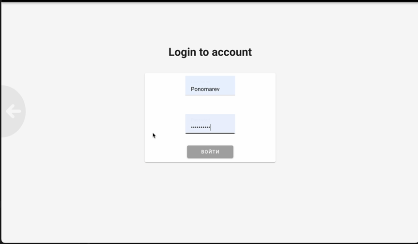
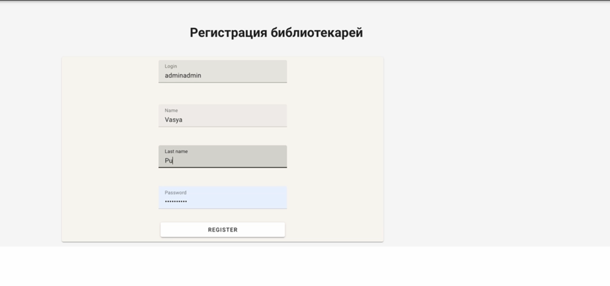
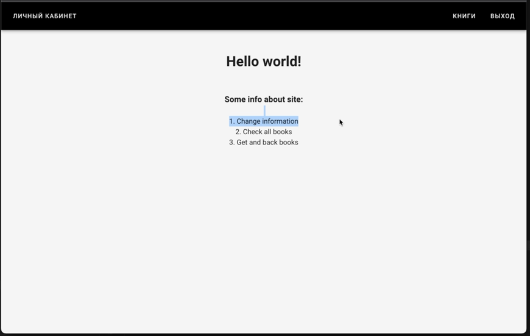
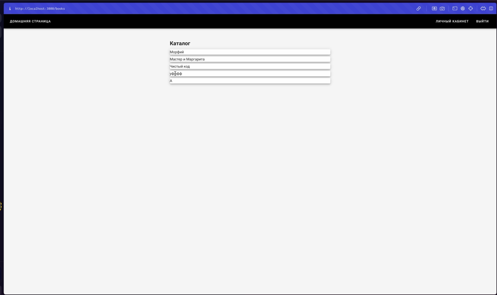
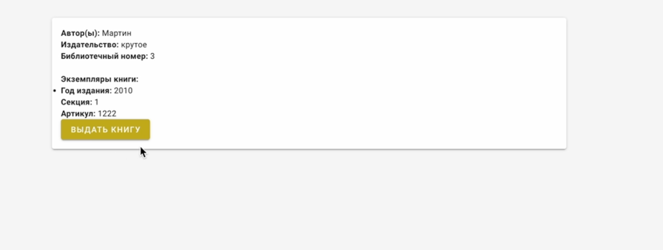

# Лабораторная работа 4

## Цель лабораторной работы

Овладеть практическими навыками и умениями реализации клиентской части приложения средствами vue.js.
##Практическое задание
Порядок выполнения работы:

* Реализовать интерфейсы авторизации, регистрации и изменения учётных данных и настроить взаимодействие с серверной
  частью
* Реализовать клиентские интерфейсы и настроить взаимодействие с серверной частью
* Подключить vuetify или аналогичную библиотеку
  ##Описание работы (вариант 2)
  Создать программную систему, предназначенную для работников библиотеки. Такая система должна обеспечивать хранение
  сведений об имеющихся в библиотеке книгах, о читателях библиотеки и читальных залах.

Для каждой книги в БД должны храниться следующие сведения: название книги, автор (ы), издательство, год издания, раздел,
число экземпляров этой книги в каждом зале библиотеки, а также шифр книги и дата закрепления книги за читателем. Книги
могут перерегистрироваться в другом зале.

## Реализация функционала

- Регистрация и авторизация от имени библиотекаря.
- Изменение данных (ФИО) библиотекаря.
- Просмотр всех книг.
- Просмотр всех экземпляров книг
- Закрепление книги за читателем.
- Открепление книги от читателя.

#### Homeview.vue

    <template>
      <v-app>
        <bar-layout>
          <v-btn v-if="auth" @click="navigateToAccount()" text>Личный кабинет</v-btn>
          <v-spacer></v-spacer>
          <v-btn v-if="auth" @click="Books()" text>Книги</v-btn>
          <v-btn v-if="auth" @click="goLogout()" text>Выход</v-btn>
        </bar-layout>
        <v-main class="vh-100" style="background-color: hsl(0, 0%, 96%);">
          <br>
          <br>
          <HomePage/>
        </v-main>
      </v-app>
    </template>
    
    <script>
    import BarLayout from '@/layouts/BarLayout.vue'
    import HomePage from '@/components/HomePage.vue'
    
    export default {
      name: 'HomeView',
      components: {BarLayout, HomePage},
      computed: {
        auth() {
          let auth;
          if (localStorage.auth_token) {
            auth = true
          }
          return auth
        }
      },
      methods: {
        goLogout() {
          localStorage.clear()
          this.$router.push({name: 'Login'})
        },
        Books() {
          this.$router.push({name: 'BooksCatalog'})
        },
        navigateToAccount() {
          this.$router.push({name: 'Manager'})
        },
      }
    }
    </script>

#### api.js
Не стал делать проксирующий репозиторий просто ради того, чтобы соблюдать clean, в данной ЛР достаточно простого api, 
который возвращает result.

    import instance from "@/domain/instance";
    
    class LibraryApi {
      constructor(instance) {
        this.API = instance
      }
    
      register = async (signUpForm) => {
        await this.API.post('/auth/users/', signUpForm, {
          headers: {
            'Content-Type': 'application/json'
          }
        })
      }
    
      login = async (username, password) => {
        return await this.API.post('/auth/token/login/',
          {
            password: password,
            username: username
          })
      }
    
      getTakingBooks = async () => {
        return await this.API.get('/library/taking_book/list')
      }
    
      deleteTakingBooks = async (id) => {
        await this.API.delete('/library/taking_book/delete/' + id)
      }
    
      sendTakingBook = async (instanceBook) => {
        return await this.API.post('/library/taking_book/give', instanceBook)
      }
    
      getAllBooks = async () => {
        return await this.API.get('/library/books/list/')
      }
    
      getReadersList = async () => {
        return await this.API.get('/library/readers/list/')
      }
    
      getBook = async (id) => {
        return await this.API.get('/library/books/' + id)
      }
    
      getUser = async () => {
        return await this.API.get('/auth/users/me/', {
            headers: {
              Authorization: `Token ${localStorage.auth_token}`,
            }
          }
        )
      }
    
      changeUserData = async (userData) => {
        await this.API.patch('/auth/users/me/', userData)
      }
    }
    
    const libraryApi = new LibraryApi(instance)
    export default libraryApi

# Роутинг

```
  import {createRouter, createWebHistory} from 'vue-router'
  
  
  const router = createRouter({
    history: createWebHistory(import.meta.env.BASE_URL),
    routes: [
      {
        path: '/',
        name: 'Login',
        component: () => import('@/views/LoginView')
      },
      {
        path: '/registration',
        name: 'Registration',
        component: () => import('@/views/RegistrationView')
      },
      {
        path: '/home',
        name: 'Home',
        component: () => import('@/views/HomeView.vue')
      },
      {
        path: '/books',
        name: 'BooksCatalog',
        component: () => import('@/views/BooksCatalogView')
      },
      {
        path: '/books/:id',
        name: 'BooksDetail',
        component: () => import('@/views/BookDetailsView')
      },
      {
        path: '/manager',
        name: 'Manager',
        component: () => import('@/views/ManagerInfoView')
      },
      {
        path: '/edit',
        name: 'EditProfile',
        component: () => import('@/views/EditProfileView')
      },
      {
        path: '/taken-books',
        name: 'TakenBooks',
        component: () => import('@/views/TakenBooksView.vue')
      }
    ]
  })
  ```

# Проверка авторизации
Добавил обязательную проверку на авторизацию, теперь если токена нет в системе, то нам просто не даст пройти дальше логина или регистрации

```
  router.beforeEach(async (to) => {
    if (!localStorage.auth_token &&
      to.name !== 'Login' &&
      to.name !== 'Registration'
    ) {
      console.log("redirect to auth")
      return {name: 'Login'}
    }
  })
  
  export default router
```

# Логин

# Регистрация

# Главная

# Список книг

# Детали книг

# Выдача книг



# ЛК работника


