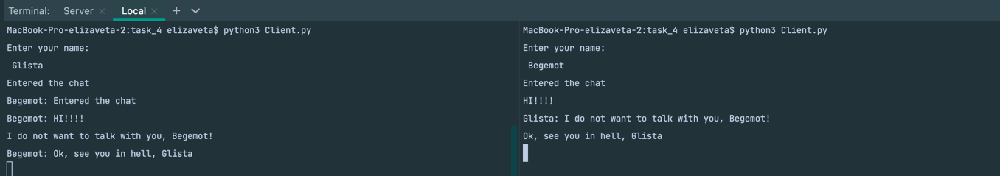

#  🗿 Задача 4
Реализовать двухпользовательский или многопользовательский чат. Реализация
многопользовательского часа позволяет получить максимальное количество
баллов.

## 🥸 Реализация
1. Server.py
   
```python
import socket
import threading

server = socket.socket(socket.AF_INET, socket.SOCK_STREAM)
server.bind((socket.gethostname(), 9090))
server.listen(5)
clients = {}


def send_message(message, client_socket):
    name = clients[client_socket]
    message = f"{name}: {message}".encode()
    for client in clients.keys():
        if client != client_socket:
            client.send(message)


def handle_client(client_socket):
    while True:
        try:
            message = client_socket.recv(1024).decode()
            send_message(message, client_socket)
        except:
            clients.pop(client_socket)
            client_socket.close()
            send_message("Left the chat", client_socket)
            break


while True:
    client_socket, addr = server.accept()
    client_socket.send("nickname".encode())
    name = client_socket.recv(1024).decode()
    clients[client_socket] = name
    send_message("Entered the chat", client_socket)
    thread = threading.Thread(target=handle_client, args=(client_socket,))
    thread.start()

```
2. Client.py
```python
import socket
import threading

nickname = input("Enter your name:\n ")

client = socket.socket(socket.AF_INET, socket.SOCK_STREAM)
client.connect((socket.gethostname(), 9090))
print("Entered the chat")


def get_message():
    while True:
        try:
            message = client.recv(1024).decode()
            if message == "nickname":
                client.send(nickname.encode())
            else:
                print(message)
        except Exception as exception:
            print(exception)
            client.close()
            break


def send_message():
    while True:
        message = input("").encode()
        client.send(message)


get_thread = threading.Thread(target=get_message)
get_thread.start()

send_thread = threading.Thread(target=send_message)
send_thread.start()
```

## 🤡 Демонстрация работы


