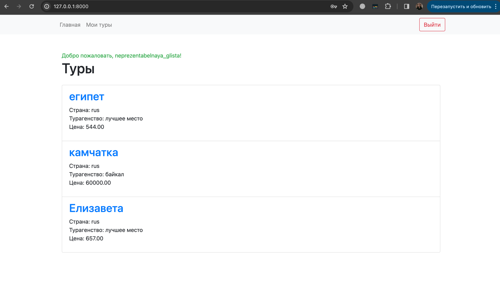
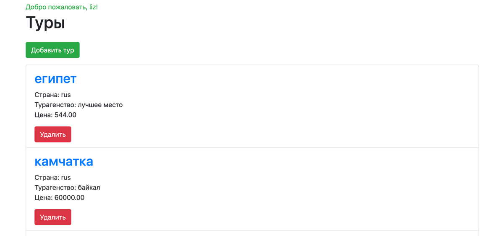
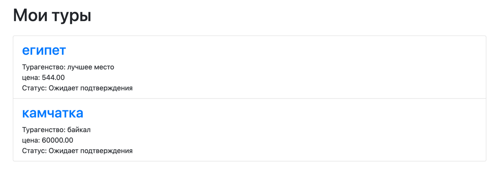
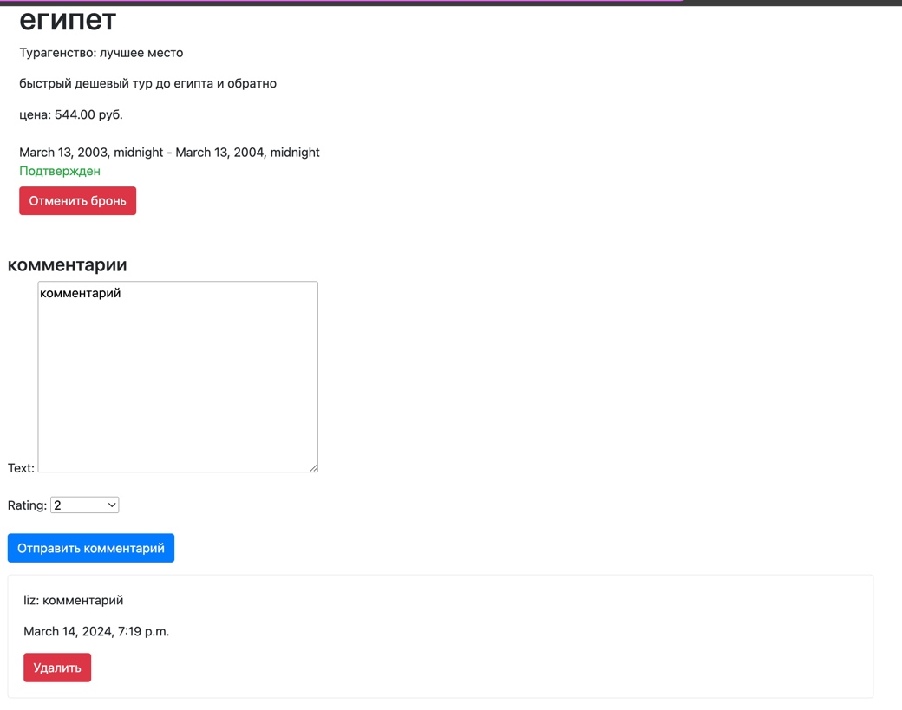

# Отчет по лабораторной работе №2

## Цель работы:
Овладеть практическими навыками и умениями реализации web-сервисов средствами Django 2.2.

## Задание
### Текст задания:
Реализовать сайт используя фреймворк Django 3 и СУБД PostgreSQL *, в соответствии с вариантом задания лабораторной работы.

Хранится информация о названии тура, турагенстве, описании тура, периоде проведения тура, условиях оплаты. Необходимо реализовать следующий функционал:

Регистрация новых пользователей.
Просмотр и резервирование туров. Пользователь должен иметь возможность редактирования и удаления своих резервирований.
Написание отзывов к турам. При добавлении комментариев, должны сохраняться даты тура, текст комментария, рейтинг (1-10), информация о комментаторе.
Администратор должен иметь возможность подтвердить резервирование тура средствами Django-admin.
В клиентской части должна формироваться таблица, отображающая все проданные туры по странам.

### Ход работы:
Для начала было создано приложение, которое включает в себя регистрацию и авторизацию пользователей и основную логику сервиса. Также были созданы модели для базы данных и пользователь был наследован от AbstractUser для возможности авториации в системе. 
### Модели:

```
class Tour(models.Model):
    id = models.AutoField(primary_key=True)
    name = models.CharField(max_length=100)
    agency_name = models.CharField(max_length=100)
    country = models.CharField(max_length=50)
    description = models.TextField()
    start_date = models.DateField()
    end_date = models.DateField()
    price = models.DecimalField(max_digits=10, decimal_places=2)


class User(AbstractUser):
    id = models.AutoField(primary_key=True)
    birth_date = models.DateField(null=True)
    email = models.EmailField(unique=True, null=True)
    reserved_tours = models.ManyToManyField(Tour, through='Reservation')
    def __str__(self):
        return self.username


class Reservation(models.Model):
    id = models.AutoField(primary_key=True)
    tour = models.ForeignKey(Tour, on_delete=models.CASCADE)
    user = models.ForeignKey(User, on_delete=models.CASCADE)
    start_date = models.DateTimeField()
    end_date = models.DateTimeField()
    STATUS_CHOICES = [
        ('Ожидает подтверждения', 'Ожидает подтверждения'),
        ('Подтвержден', 'Подтвержден'),
    ]
    status = models.CharField(max_length=50, choices=STATUS_CHOICES)


class TourComment(models.Model):
    id = models.AutoField(primary_key=True)
    user = models.ForeignKey(User, on_delete=models.CASCADE)
    tour = models.ForeignKey(Tour, on_delete=models.CASCADE)
    text = models.TextField()
    rating = models.PositiveIntegerField(choices=zip(range(1, 11), range(1, 11)))
    date_written = models.DateTimeField(auto_now_add=True)

```
Сначала была реализована логика авторизации и регистрации. 
### маршруты пользователя:
```
    path("register/", views.register, name="register"),
    path('login/', views.LoginView, name='login'),
    path("logout/", views.user_logout, name="logout"),
```

Были реализованы пользовательские формы, , основанные на встроенных функциях:
```
class RegistrationForm(forms.ModelForm):
    class Meta:
        model = User
        fields = ["username", "password", "first_name", "last_name", "email"]


class CustomAuthenticationForm(AuthenticationForm):
    class Meta:
        model = User
```

Обработка запросов выглядит следующим образом:
```
def register(request):
    if request.method == "POST":
        user_form = RegistrationForm(request.POST)
        if user_form.is_valid():
            user = user_form.save()
            user.set_password(user.password)
            user.save()
            return redirect("login")
    else:
        user_form = RegistrationForm()

    return render(request, "register.html", {"user_form": user_form})
    
def LoginView(request):
    if request.method == 'POST':
        form = CustomAuthenticationForm(data=request.POST)
        if form.is_valid():
            user = form.get_user()
            login(request, user)
            return redirect('index')
    else:
        form = CustomAuthenticationForm()
    return render(request, 'login.html', {'form': form})

```
В файле admin были созданы две группы пользователей:
```
user_group, created = Group.objects.get_or_create(name='Пользователь')
admin_group, created = Group.objects.get_or_create(name='Администратор')
```
Также созданы html шаблоны для каждой формы регистрации и входа.

### логика сервиса
Роуты выглядят следующим образом:
```
    path('', views.index, name='index'),
    path('my_tours', views.my_tours, name='my_tours'),
    path('tour/<int:tour_id>', views.tour_page, name='tour_page'),
    path('delete_comment/<int:comment_id>/', views.delete_comment, name='delete_comment'),
    path('tour/<int:tour_id>/create_reservation/', views.create_reservation, name='create_reservation'),
    path('tour/<int:tour_id>/delete_reservation/', views.delete_reservation, name='delete_reservation'),
    path('tour/<int:reservation_id>/access_reservation_admin/', views.access_reservation_admin, name='access_reservation_admin'),
    path('tour/<int:reservation_id>/delete_reservation_admin/', views.delete_reservation_admin, name='delete_reservation_admin'),
    path('tour/<int:reservation_id>/cancel_reservation_admin/', views.cancel_reservation_admin, name='cancel_reservation_admin'),
    path('create_tour/', views.create_tour, name='create_tour'),
    path('<int:tour_id>/delete_tour/', views.delete_tour, name='delete_tour'),
```
Здесь представлены ссылки на главную страницу и страницу с турами, на которые пользователь сделал бронь. Также здесь доступны функции добавления и удаления комментариев, создания и удаления бронирований. Для администратора доступны функции управления бронированиями и создания/удаления туров.
### Главная страница 
У обычного пользователя она выглядит следующим образом:

От сюда можно перейти на страницу конкретнго тура или на страницу с резервированиями.

Если у пользователя есть права администратора, то на странице появляются функции добавления нового тура и удаления уже существующих

Добавление нового тура:

### Страница резервирований
У обычного пользователя она выглядит следующим образом:

При переходе на определенный тур открывается страница тура.

У администратора здесь отображаются все резервирования всех пользователей

Администратор может подтвердить или отменить подтверждение резервирования тура, а также удалить резервацию.

### Страница тура
Страница тура выглядит так:

Здесь есть функция добавления резервирования, а также комментарии. Свои комментарии можно удалять.
# Вывод
В ходе выполнения работы я освоила основные принципы фреймворка Django и научилась создавать сайт с базовым функционалом