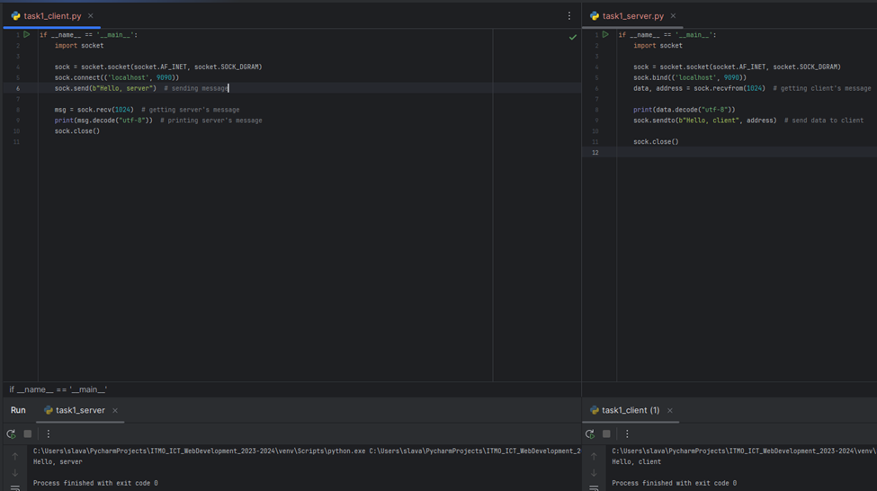

# Задание 1

Реализовать клиентскую и серверную часть приложения. Клиент отсылает серверу сообщение «Hello, server». Сообщение должно отразиться на стороне сервера. Сервер в ответ отсылает клиенту сообщение «Hello, client». Сообщение должно отобразиться у клиента.

Обязательно использовать библиотеку socket

Реализовать с помощью протокола UDP

## Ход выполнения работы

### Код task1_client.py

    if __name__ == '__main__':
        import socket
        sock = socket.socket(socket.AF_INET, socket.SOCK_DGRAM)
        sock.connect(('localhost', 9090))
        sock.send(b"Hello, server")  # sending message
        msg = sock.recv(1024)  # getting server's message
        print(msg.decode("utf-8"))  # printing server's message
        sock.close()

### Код task1_server.py

    if __name__ == '__main__':
        import socket
        sock = socket.socket(socket.AF_INET, socket.SOCK_DGRAM)
        sock.bind(('localhost', 9090))
        data, address = sock.recvfrom(1024)  # getting client's message
        print(data.decode("utf-8"))
        sock.sendto(b"Hello, client", address)  # send data to client
        sock.close()

## Результат

