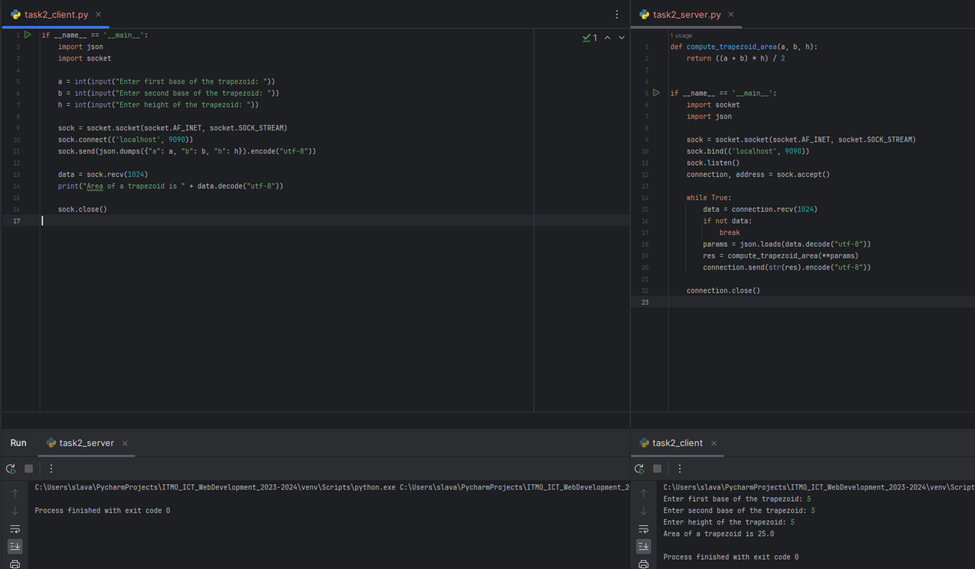

# Задание 2

Реализовать клиентскую и серверную часть приложения. Клиент запрашивает у сервера выполнение математической операции, параметры, которые вводятся с клавиатуры. Сервер обрабатывает полученные данные и возвращает результат клиенту. Вариант: Поиск площади трапеции.

Обязательно использовать библиотеку socket

Реализовать с помощью протокола TCP

## Ход выполнения работы

### Код task2_server.py

    def compute_trapezoid_area(a, b, h):
    return ((a + b) * h) / 2

    if __name__ == '__main__':
        import socket
        import json
    
        sock = socket.socket(socket.AF_INET, socket.SOCK_STREAM)
        sock.bind(('localhost', 9090))
        sock.listen()
        connection, address = sock.accept()
    
        while True:
            data = connection.recv(1024)
            if not data:
                break
            params = json.loads(data.decode("utf-8"))
            res = compute_trapezoid_area(**params)
            connection.send(str(res).encode("utf-8"))
    
        connection.close()

### Код task2_client.py

    if __name__ == '__main__':
        import json
        import socket
    
        a = int(input("Enter first base of the trapezoid: "))
        b = int(input("Enter second base of the trapezoid: "))
        h = int(input("Enter height of the trapezoid: "))
    
        sock = socket.socket(socket.AF_INET, socket.SOCK_STREAM)
        sock.connect(('localhost', 9090))
        sock.send(json.dumps({"a": a, "b": b, "h": h}).encode("utf-8"))
    
        data = sock.recv(1024)
        print("Аrea of a trapezoid is " + data.decode("utf-8"))
    
        sock.close()

## Результат

