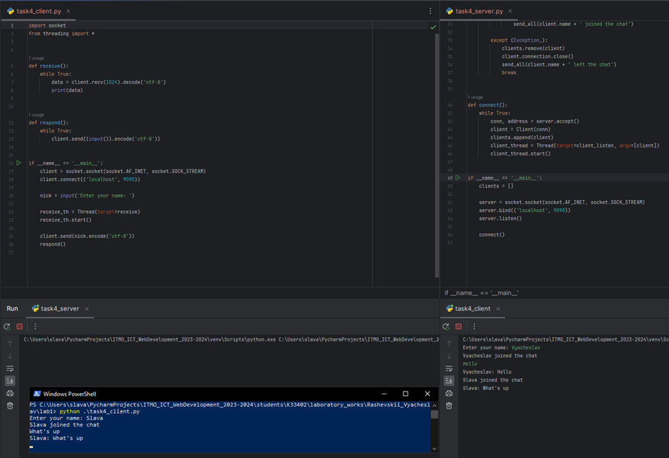

# Задание 4

Реализовать двухпользовательский или многопользовательский чат. Реализация многопользовательского часа позволяет получить максимальное количество баллов.

Обязательно использовать библиотеку threading

## Ход выполнения работы

### Код task4_server.py

    import socket
    from threading import *
    
    
    class Client:
        def __init__(self, connection):
            self.connection = connection
            self.name = ""
            self.is_ready = False
    
    
    def send_all(mes):
        for client in clients:
            if client.is_ready:
                client.connection.send(mes.encode("utf-8"))
    
    
    def client_listen(client):
        while True:
            try:
                data = client.connection.recv(1024)
                if not data:
                    raise
    
                message = data.decode("utf-8")
                if client.is_ready:
                    send_all(client.name + ': ' + message)
                else:
                    client.name = message
                    client.is_ready = True
                    send_all(client.name + ' joined the chat')
    
            except (Exception,):
                clients.remove(client)
                client.connection.close()
                send_all(client.name + ' left the chat')
                break
    
    
    def connect():
        while True:
            conn, address = server.accept()
            client = Client(conn)
            clients.append(client)
            client_thread = Thread(target=client_listen, args=[client])
            client_thread.start()
    

    if __name__ == '__main__':
        clients = []
    
        server = socket.socket(socket.AF_INET, socket.SOCK_STREAM)
        server.bind(('localhost', 9090))
        server.listen()
    
        connect()

### Код task4_client.py

    import socket
    from threading import *
    
    
    def receive():
        while True:
            data = client.recv(1024).decode('utf-8')
            print(data)
    
    
    def respond():
        while True:
            client.send((input()).encode('utf-8'))

    
    if __name__ == '__main__':
        client = socket.socket(socket.AF_INET, socket.SOCK_STREAM)
        client.connect(('localhost', 9090))
    
        nick = input('Enter your name: ')
    
        receive_th = Thread(target=receive)
        receive_th.start()
    
        client.send(nick.encode('utf-8'))
        respond()

## Результат

