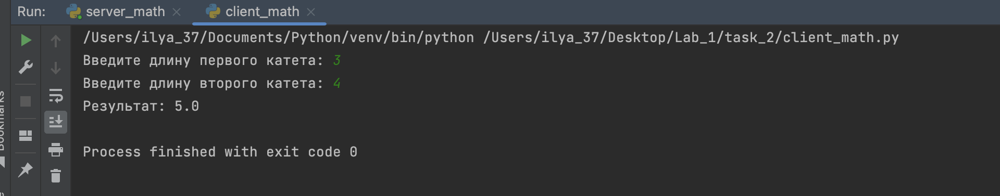

# Задание №2
___
Реализовать клиентскую и серверную часть приложения. 
Клиент запрашивает у сервера выполнение математической операции, параметры, которые вводятся с клавиатуры. 
Сервер обрабатывает полученные данные и возвращает результат клиенту. 
Вариант: Решение квадратного уравнения.

## Реализация 

server_math.py 
```python
import socket

def calculate_hypotenuse(a, b):
    return (a**2 + b**2)**0.5

def start_server():
    server_socket = socket.socket(socket.AF_INET, socket.SOCK_STREAM)

    server_address = ('localhost', 12124)
    server_socket.bind(server_address)

    server_socket.listen(1)
    print("Сервер ожидает подключения...")

    while True:
        client_socket, client_address = server_socket.accept()
        print(f"Подключено клиентом: {client_address}")

        data = client_socket.recv(1024).decode('utf-8')
        print(f"Получено от клиента: {data}")

        a, b = map(float, data.split(','))

        # Выполняем операцию (теорема Пифагора)
        result = calculate_hypotenuse(a, b)

        client_socket.send(str(result).encode('utf-8'))
        client_socket.close()

if __name__ == "__main__":
    start_server()
```
client_math.py
```python
import socket

def start_client():
    client_socket = socket.socket(socket.AF_INET, socket.SOCK_STREAM)
    server_address = ('localhost', 12124)
    client_socket.connect(server_address)
    
    a = float(input("Введите длину первого катета: "))
    b = float(input("Введите длину второго катета: "))
    
    data = f"{a},{b}"
    client_socket.send(data.encode('utf-8'))
    
    result = client_socket.recv(1024).decode('utf-8')
    print(f"Результат: {result}")
    
    client_socket.close()

if __name__ == "__main__":
    start_client()
```
## Результаты 

