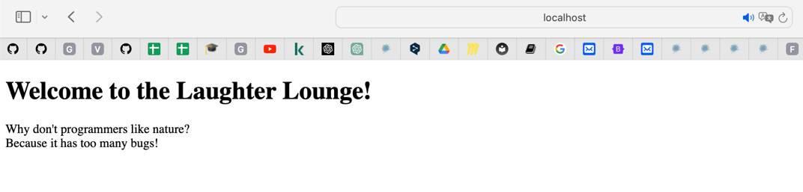

# Задание №3
Реализовать серверную часть приложения. 
Клиент подключается к серверу. 
В ответ клиент получает http-сообщение, содержащее html-страницу, которую сервер подгружает из файла index.html.

## Реализация 

http_server.py
```python
import socket

def read_file(filename):
    try:
        with open(filename, 'r', encoding='utf-8') as file:
            return file.read()
    except FileNotFoundError:
        return "Файл не найден"

s_socket = socket.socket(socket.AF_INET, socket.SOCK_STREAM)

s_address = ('localhost', 12413)
s_socket.bind(s_address)

s_socket.listen(1)
print('Сервер ожидает подключения клиента...')

while True:
    c_socket, c_address = s_socket.accept()
    print(f'Подключено клиентом {c_address}')

    try:
        html_content = read_file('index.html')
        request = c_socket.recv(1024)
        http_response = f"HTTP/1.1 200 OK\r\n Content type:html \r\n Content-Length: {len(html_content)}\r\n\r\n{html_content}"
        c_socket.sendall(http_response.encode('utf-8'))
    except Exception as e:
        print(f'Ошибка: {str(e)}')
    finally:
        c_socket.close()
```

index.html

```html
<!DOCTYPE html>
<html>
<head>
    <meta charset="UTF-8">
    <title> It's my Joke Page </title>
</head>
<body>
    <h1> Welcome to the Laughter Lounge! </h1>
    <p>Why don't programmers like nature?<br>Because it has too many bugs! </p>
</body>
</html>
```

## Результаты
