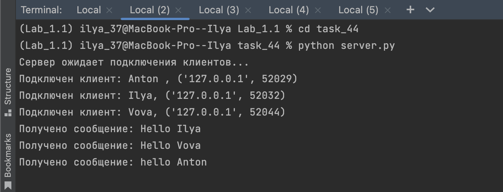
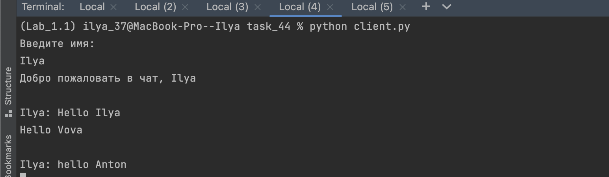

# Задание №4
___
Реализовать двухпользовательский или многопользовательский чат. 
Реализация многопользовательского часа позволяет 
получить максимальное количество баллов.

## Реализация 
server.py

```python
import socket
import threading

clients = {}
s_socket = socket.socket(socket.AF_INET, socket.SOCK_STREAM)
s_address = ('localhost', 12476)
s_socket.bind(s_address)
s_socket.listen(5)
print('Сервер ожидает подключения клиентов...')

def handle_client(c_socket):
    while True:
        try:
            message = c_socket.recv(1024).decode()
            if not message:
                clients.remove(c_socket)
                c_socket.close()
                break
            print(f'Получено сообщение: {message}')
            for c_sock, name in clients.items():
                if c_sock != c_socket:
                    c_sock.send(f'\n{name}: {message}'.encode())
        except Exception as e:
            print(f'Ошибка при обработке сообщения: {str(e)}')

while True:
    c_socket, c_address = s_socket.accept()
    c_socket.send('Введите имя: '.encode())
    name = c_socket.recv(1024).decode()
    c_socket.send(f'Добро пожаловать в чат, {name}'.encode())
    clients[c_socket] = name
    print(f'Подключен клиент: {name}, {c_address}')
    client_thread = threading.Thread(target=handle_client, args=(c_socket,))
    client_thread.start()
```

client.py

```python
import socket
import threading
import sys

def send_message():
    while True:
        message = input()
        c_socket.send(message.encode())

c_socket = socket.socket(socket.AF_INET, socket.SOCK_STREAM)
s_address = ('localhost', 12476)
c_socket.connect(s_address)
send_thread = threading.Thread(target=send_message)
send_thread.start()

while True:
    try:
        message = c_socket.recv(1024).decode()
        print(message)
    except Exception as e:
        print(f'Ошибка при получении сообщения: {str(e)}')
        break

c_socket.close()
```

## Результаты 



