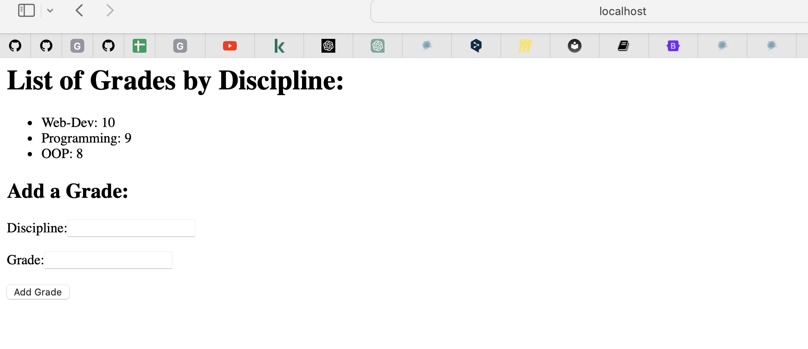
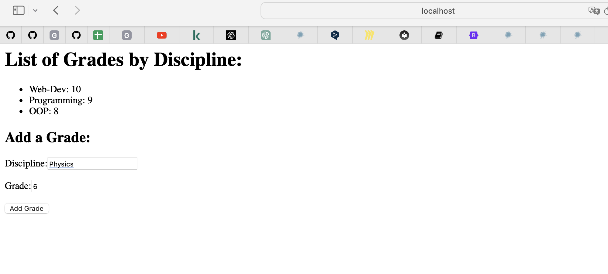

# Задание №5
___
Необходимо написать простой web-сервер для обработки GET и POST http
запросов средствами Python и библиотеки socket.
Задание: сделать сервер, который может:
* Принять и записать информацию о дисциплине и оценке по дисциплине.
* Отдать информацию обо всех оценах по дсициплине в виде html-страницы.

## Реализация
server.py

```python
import socket
import threading
import urllib.parse  # For parsing URL-encoded data

class WebServer:
    def __init__(self, host, port):
        self.host = host
        self.port = port
        self.server_socket = socket.socket(socket.AF_INET, socket.SOCK_STREAM)
        self.disciplines_data = {}

    def start(self):
        self.server_socket.bind((self.host, self.port))
        self.server_socket.listen(5)
        print('Server is waiting for client connections...')

        while True:
            client_socket, client_address = self.server_socket.accept()
            print(f'Connected to client: {client_address}')
            client_thread = threading.Thread(target=self.handle_client, args=(client_socket,))
            client_thread.start()

    def handle_client(self, client_socket):
        try:
            request_data = client_socket.recv(1024).decode('utf-8')
            
            if request_data.startswith("GET /"):
                self.handle_get_request(client_socket)
            elif request_data.startswith("POST /"):
                request_body = request_data.split('\r\n\r\n')[1]
                self.handle_post_request(client_socket, request_body)
        except Exception as e:
            print(f'Error while processing the request: {str(e)}')
        finally:
            client_socket.close()

    def handle_get_request(self, client_socket):
        response = "HTTP/1.1 200 OK\r\nContent-Type: text/html\r\n\r\n"
        response += "<html><body>"
        response += "<h1>List of Grades by Discipline:</h1>"
        response += "<ul>"
        for discipline, grades in self.disciplines_data.items():
            response += f"<li>{discipline}: {', '.join(grades)}</li>"
        response += "</ul>"
        response += "<h2>Add a Grade:</h2>"
        response += "<form method='POST' action='/'>"
        response += "<label for='discipline'>Discipline:</label>"
        response += "<input type='text' id='discipline' name='discipline' required><br><br>"
        response += "<label for='grade'>Grade:</label>"
        response += "<input type='text' id='grade' name='grade' required><br><br>"
        response += "<input type='submit' value='Add Grade'>"
        response += "</form>"
        response += "</body></html>"
        client_socket.send(response.encode('utf-8'))

    def handle_post_request(self, client_socket, data):
        try:
            # Parse URL-encoded data
            parsed_data = urllib.parse.parse_qs(data)
            discipline = parsed_data.get('discipline', [''])[0]
            grade = parsed_data.get('grade', [''])[0]

            if discipline and grade:
                if discipline in self.disciplines_data:
                    self.disciplines_data[discipline].append(grade)
                else:
                    self.disciplines_data[discipline] = [grade]

            response = "HTTP/1.1 303 See Other\r\nLocation: /\r\n\r\n"
            client_socket.send(response.encode('utf-8'))
        except Exception as e:
            print(f'Error while processing POST request: {str(e)}')
            response = "HTTP/1.1 500 Internal Server Error\r\n\r\n"
            client_socket.send(response.encode('utf-8'))

if __name__ == "__main__":
    web_server = WebServer('localhost', 12477)
    web_server.start()
```

## Результаты 

