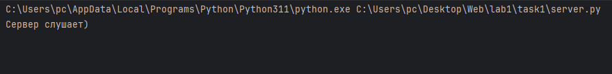
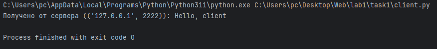
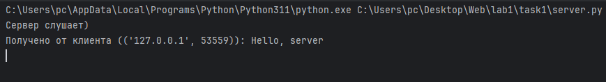

# Задание 1

Реализовать клиентскую и серверную часть приложения. Клиент отсылает серверу сообщение «Hello, server». Сообщение должно отразиться на стороне сервера. Сервер в ответ отсылает клиенту сообщение «Hello, client». Сообщение должно отобразиться у клиента.

Обязательно использовать библиотеку socket

Реализовать с помощью протокола UDP

## Ход выполнения работы

### Код client.py

    import socket
    
    client_socket = socket.socket(socket.AF_INET, socket.SOCK_DGRAM)
    server_address = ('localhost', 2222)
    message = b"Hello, server" # наконец я нашёл применение к этому префексу
    client_socket.sendto(message, server_address)
    
    data, server_address = client_socket.recvfrom(1024) # Ждемc
    print(f"Получено от сервера ({server_address}): {data.decode()}")

### Код server.py

    import socket

    server_socket = socket.socket(socket.AF_INET, socket.SOCK_DGRAM) # Создаем сокет
    server_address = ('localhost', 2222)
    server_socket.bind(server_address)
    
    print(f"Сервер слушает)")
    
    while True:
        data, client_address = server_socket.recvfrom(1024) # Ждем
        print(f"Получено от клиента ({client_address}): {data.decode()}")
        server_socket.sendto(b"Hello, client", client_address) 

## Результат
Запускаем server.py

Запускаем client.py

Вывод в server.py после запуска client.py

