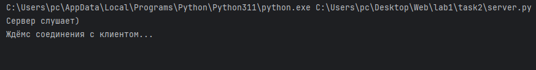
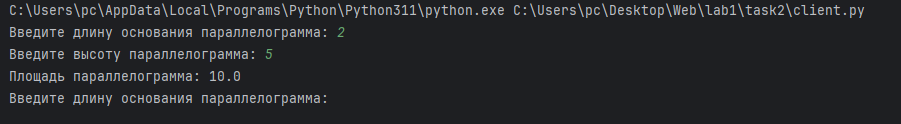
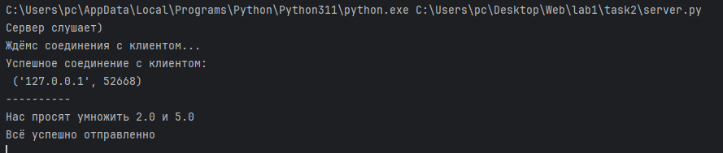

# Задание 2

Реализовать клиентскую и серверную часть приложения. Клиент запрашивает у
сервера выполнение математической операции, параметры, которые вводятся с
клавиатуры. Сервер обрабатывает полученные данные и возвращает результат
клиенту. Варианты:
a. Теорема Пифагора
b. Решение квадратного уравнения.
c. Поиск площади трапеции.
d. Поиск площади параллелограмма. (Я 24, у меня это)
Вариант выбирается в соответствии с порядковым номером в журнале. Пятый
студент получает вариант 1 и т.д.
Обязательно использовать библиотеку socket
Реализовать с помощью протокола TCP

## Ход выполнения работы

### Код client.py

    import socket

    client_socket = socket.socket(socket.AF_INET, socket.SOCK_STREAM)
    server_address = ('localhost', 2222)
    
    client_socket.connect(server_address) # У нас же TCP)
    
    while True:
        base = float(input("Введите длину основания параллелограмма: "))
        height = float(input("Введите высоту параллелограмма: "))
    
        message = f"{base},{height}"
        client_socket.sendall(message.encode())
    
        data = client_socket.recv(1024) # ждёмс...
        print(data.decode())

### Код server.py
    
    import socket

    
    server_socket = socket.socket(socket.AF_INET, socket.SOCK_STREAM)
    server_address = ('localhost', 2222)
    server_socket.bind(server_address)
    
    server_socket.listen(1) # А тут, в отличии от UDP, мы прям соеденимся с клиентом. ТОЛЬКО с 1 ))
    
    print(f"Сервер слушает)")
    print("Ждёмс соединения с клиентом...")
    client_socket, client_address = server_socket.accept()
    print(f"Успешное соединение с клиентом:\n {client_address}")
    
    while True:
        data = client_socket.recv(1024) # Нужен для TCP и не говорит аддрес (но он нам и не нужен, мы же TCP)
        print("-"*10)
        params = data.decode().split(',')
    
        if len(params) == 2:
            base = float(params[0])
            height = float(params[1])
            result = base * height
            print(f"Нас просят умножить {base} и {height}")
            response = f"Площадь параллелограмма: {result}"
            client_socket.sendall(response.encode()) # Это вам не sendto, тут всё чётко и побайтово :D.
            print("Всё успешно отправленно")
        else:
            client_socket.sendall("Неверное количество параметров".encode()) # опять побайтово... ну емае.
            print("Всё плохо")

## Результат

Запускаем server.py

Запускаем client.py и вводим данные

Вывод в server.py после запуска client.py

