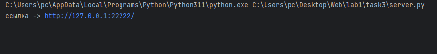
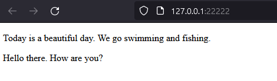

# Задание 3

Реализовать серверную часть приложения. Клиент подключается к серверу. В ответ
клиент получает http-сообщение, содержащее html-страницу, которую сервер
подгружает из файла index.html.

## Ход выполнения работы

Пометка: Примерно на этом моменте, я понял, что лучше определять сокеты через "with". Что бы они закрывались независимо от ошибок.
Это должны выглядить как-то так: with socket.socket(socket.AF_INET, socket.SOCK_DGRAM) as s:
Но я думаю это не страшно в данном примере :D.
Да и погуглив, я нашёл, что толи в pycharm толи сам python после остановки проги сами всё подчищают
Но я точно не стал бы так делать в серъёзном проекте... надеюсь...

### Код server.py

    import socket
    
    
    HOST = '127.0.0.1'
    PORT = 22222
    server_socket = socket.socket(socket.AF_INET, socket.SOCK_STREAM)
    server_socket.bind((HOST, PORT))
    
    server_socket.listen()
    
    print(f"ссылка -> http://{HOST}:{PORT}/")
    
    while True:
        client_socket, client_address = server_socket.accept()
        print(f"подключение от {client_address}")
        with open("index.html", 'r') as file:
            html_content = file.read()
        # Тут кстати советовалось использовать \r, что бы переносить на начало строки. 
        # Но я так посмотрел, и не нашёл причин для этого.
        http_response = f"HTTP/1.1 200 OK\nContent-Type: text/html\nContent-Length: {len(html_content)}\n\n{html_content}"
        #print(http_response)
        client_socket.sendall(http_response.encode('utf-8'))

# index.html

    <!DOCTYPE html>
    <html lang="ru">
    <head>
        <meta charset="UTF-8">
        <meta name="viewport" content="width=device-width, initial-scale=1.0">
        <title>My html page</title>
    </head>
    <body>
    
        

            Today is a beautiful day. We go swimming and fishing.
        

    
        

             Hello there. How are you?
        

    
    </body>
    </html>

## Результат
Запускаем server.py

Переходим по ссылке

