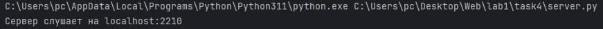
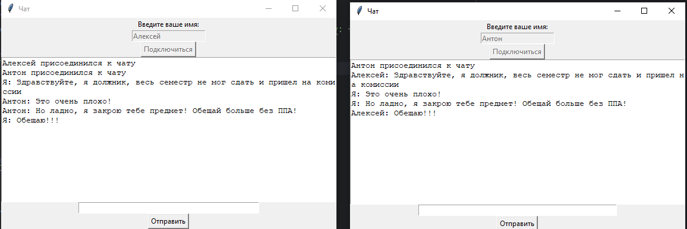
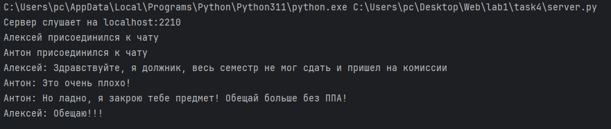

# Задание 4

Реализовать двухпользовательский или многопользовательский чат. Реализация
многопользовательского часа позволяет получить максимальное количество баллов.
Обязательно использовать библиотеку threading

## Ход выполнения работы

Я запустил всё это на своем сервере, что бы протестировать и пообщаться с друзьями.
по этому ip 45.138.26.182

### Код server.py

    import socket
    import threading
    
    clients = {}
    last_messages = {}
    
    def handle_client(client_socket, username):
        while True:
            try:
                message = client_socket.recv(1024).decode('utf-8')
                if not message:
                    break
                if check_spam(username, message):
                    pass
                else:
                    send_to_all(username + ": " + message, client_socket)
                    print(username + ": " + message)
    
            except Exception as e:
                print(f"Ошибка при обработке сообщения от {username}: {e}")
                break
    
        #Кикаем
        del clients[username]
        del last_messages[username]
        print(f"{username} отключен")
        send_to_all(f"{username} покинул чат", client_socket)
        client_socket.close()
    
    
    def send_to_all(message, sender_socket):
        for client, socket in clients.items():
            if socket != sender_socket:
                try:
                    socket.sendall(message.encode('utf-8'))
                except Exception as e:
                    print(f"Ошибка при отправке сообщения клиенту {client}: {e}")
    
    
    def check_spam(username, message):
        if username in last_messages and last_messages[username] == message:
            if username in clients:
                clients[username].sendall("Спам предупреждение: Не отправляйте одинаковые сообщения!".encode('utf-8'))
                return True
            else:
                return False
        else:
            return False
        last_messages[username] = message
    
    
    HOST = '45.138.26.182'
    PORT = 2210
    
    with socket.socket(socket.AF_INET, socket.SOCK_STREAM) as server_socket:
        server_socket.bind((HOST, PORT))
        server_socket.listen()
        print(f"Сервер слушает на {HOST}:{PORT}")
        while True:
            client_socket, client_address = server_socket.accept()
            username = client_socket.recv(1024).decode('utf-8')
            clients[username] = client_socket
            print(f"{username} присоединился к чату")
            send_to_all(f"{username} присоединился к чату", client_socket)
    
            # Запуск потока для обработки сообщений от клиента
            threading.Thread(target=handle_client, args=(client_socket, username)).start()

# Код client.py

    import tkinter as tk
    from tkinter import messagebox
    import socket
    import threading
    
    
    def receive_messages(client_socket):
        while True:
            try:
                message = client_socket.recv(1024).decode('utf-8')
                root.after(10, update_chat, message)
            except Exception as e:
                print(f"Ошибка при получении сообщения от сервера: {e}")
                break
    
    def update_chat(message):
        chat_box.config(state=tk.NORMAL)
        chat_box.insert(tk.END, message + '\n')
        chat_box.config(state=tk.DISABLED)
        chat_box.yview(tk.END)
    
    def send_message():
        message = message_entry.get()
        if message:
            client_socket.sendall(message.encode('utf-8'))
            root.after(10, update_chat, f"Я: {message}")
            message_entry.delete(0, tk.END)
    
    def on_closing():
        if messagebox.askokcancel("Выход", "Вы уверены, что хотите выйти из чата?"):
            if client_socket:
                client_socket.close()
            root.destroy()
    
    def connect_to_server():
        global client_socket
        username = name_entry.get()
        if username:
            try:
                client_socket = socket.socket(socket.AF_INET, socket.SOCK_STREAM)
                client_socket.connect((HOST, PORT))
                client_socket.sendall(username.encode('utf-8'))
                name_entry.config(state=tk.DISABLED)
                connect_button.config(state=tk.DISABLED)
                message_entry.config(state=tk.NORMAL)
                send_button.config(state=tk.NORMAL)
                #receive_messages(client_socket)
                threading.Thread(target=receive_messages, args=(client_socket,)).start()
                root.after(10, update_chat, f"{username} присоединился к чату")
            except Exception as e:
                messagebox.showerror("Ошибка", f"Не удалось подключиться к серверу: {e}")
    
    # Определение параметров сервера
    HOST = '45.138.26.182'
    PORT = 2210
    
    # Создание основного окна
    root = tk.Tk()
    root.title("Чат")
    
    # Окно для ввода имени
    name_label = tk.Label(root, text="Введите ваше имя:")
    name_label.pack()
    
    name_entry = tk.Entry(root)
    name_entry.pack()
    
    # Кнопка для подключения к серверу
    connect_button = tk.Button(root, text="Подключиться", command=connect_to_server)
    connect_button.pack()
    
    # Поле для вывода чата
    chat_box = tk.Text(root, state=tk.DISABLED, height=15, width=70)
    chat_box.pack()
    
    # Поле для ввода сообщений
    message_entry = tk.Entry(root, state=tk.DISABLED, width=50)
    message_entry.pack()
    
    # Кнопка для отправки сообщений
    send_button = tk.Button(root, text="Отправить", state=tk.DISABLED, command=send_message)
    send_button.pack()
    
    # Привязка Enter к отправке сообщения
    message_entry.bind("<Return>", lambda event: send_message())
    
    # Обработка закрытия окна
    root.protocol("WM_DELETE_WINDOW", on_closing)
    
    # Запуск основного цикла событий
    root.mainloop()

## Результат
Запускаем server.py

Проверяем client.py

Вывод в server.py после проверки client.py

